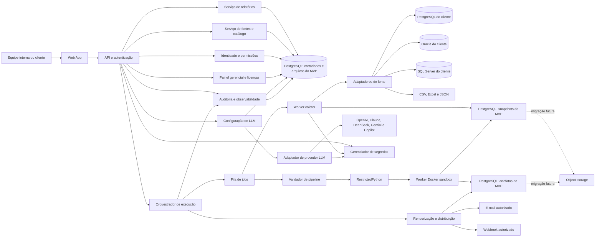
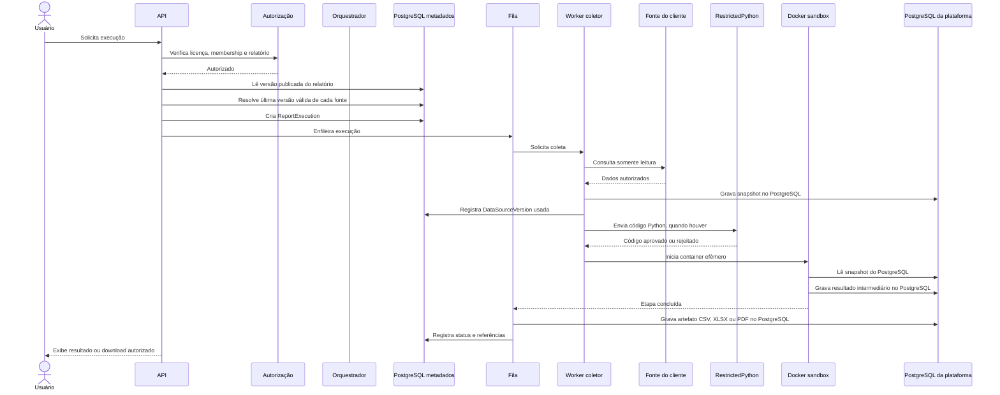
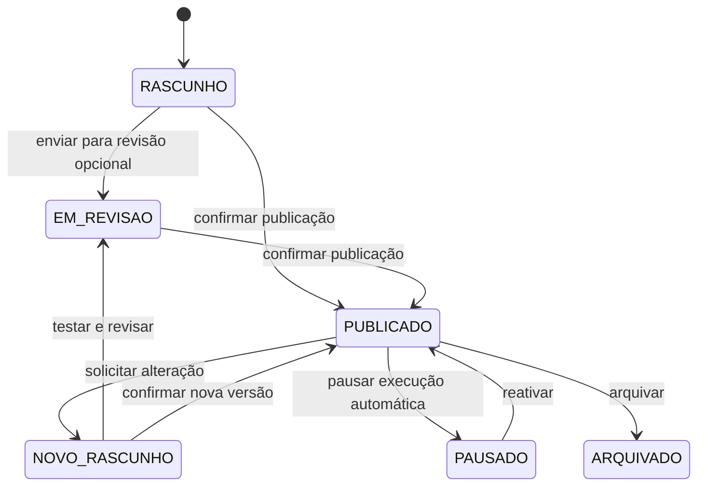
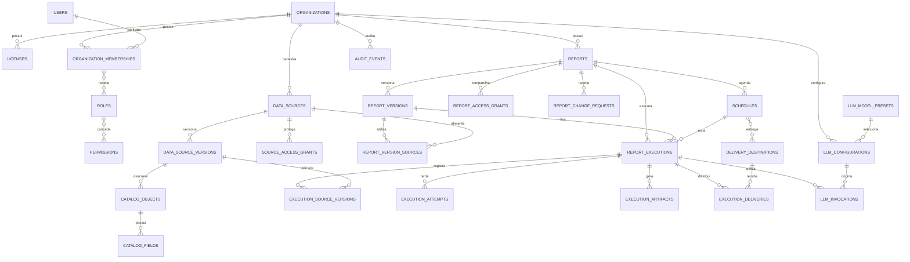

# Planejamento da Plataforma de Relatórios

> Documento vivo. As regras abaixo são uma proposta inicial de negócio e devem ser revisadas antes da implementação.

## 1. Objetivo

Criar uma plataforma multiempresa para que usuários autorizados possam:

- conectar fontes de dados, especialmente bancos relacionais;
- consultar dados por meio de relatórios reutilizáveis;
- criar relatórios a partir de uma solicitação em linguagem natural ou de uma configuração manual;
- visualizar, exportar e listar relatórios concluídos;
- manter rastreabilidade sobre dados acessados, versões, execuções e permissões.

A plataforma deve coletar e processar dados nas fontes autorizadas. Dados transacionais não devem ser enviados ao modelo de IA quando apenas metadados, consultas agregadas ou resultados mínimos forem suficientes para executar a tarefa.

## 2. Como interpretar o documento de arquitetura anexado

O arquivo `arquitetura_plataforma_langchain_docker.md` foi considerado uma referência técnica, e não uma lista de instruções obrigatórias.

As seguintes ideias foram aproveitadas como premissas a validar:

- API de backend e interface web separadas;
- isolamento de rotinas de processamento em ambiente controlado;
- uso de metadados para orientar a IA;
- catálogo de relatórios, agendamentos e controle de acesso;
- armazenamento de arquivos gerados fora do banco de metadados, quando apropriado;
- limite de tentativas de correção automática.

As tecnologias citadas no documento, como FastAPI, LangChain, LlamaIndex, Docker, PostgreSQL e S3, não são decisões definitivas de negócio. A escolha final deve considerar custo, operação, segurança, volume e requisitos dos primeiros clientes.

## 3. Escopo inicial

### 3.1 Incluído no MVP

- cadastro de organização, usuários e perfis de acesso;
- autenticação própria, com painel gerencial para criar clientes e suspender licenças;
- cadastro e validação de fontes de dados estruturadas;
- conexão com PostgreSQL, Oracle Database e Microsoft SQL Server por endereço IP público;
- importação de arquivos CSV, Excel (`.xls`/`.xlsx`) e JSON;
- leitura controlada do catálogo ou esquema das fontes;
- definição de quais tabelas, colunas, planilhas, campos e métricas podem ser utilizadas;
- criação de relatório manual ou assistida por IA;
- execução sob demanda;
- visualização em tela e exportação para CSV, XLSX e PDF;
- distribuição controlada por e-mail e webhook, sem compartilhamento público por padrão;
- versionamento da definição do relatório;
- histórico de execuções e erros;
- listagem de relatórios já concluídos e seus resultados disponíveis;
- configuração de provedores de LLM usando a API key do próprio cliente, modelo e nível de reasoning;
- auditoria das ações relevantes.

### 3.2 Fora do MVP, salvo decisão em contrário

- edição colaborativa em tempo real;
- edição livre de código pelo usuário final;
- conectores para todas as fontes de dados existentes;
- publicação pública de relatórios;
- recuperação de senha, envio transacional de e-mail e MFA;
- conexão com bancos privados por VPN, túnel seguro ou agente instalado no ambiente do cliente;
- processamento em lote, execução recorrente e agendamento automático de relatórios;
- cobrança, planos e limites comerciais;
- recursos avançados de BI, como modelagem dimensional e exploração livre de dashboards.

### 3.3 Fontes de dados sugeridas

As fontes devem ser tratadas pelo produto como um conceito único, mas cada tipo possui regras próprias de conexão, leitura, validação e atualização.

#### Primeira fase — recomendada para o MVP

- **Banco de dados relacional**: PostgreSQL, Oracle Database e Microsoft SQL Server. O acesso inicial será feito somente por IP público e com credenciais de leitura.
- **CSV**: adequado para cargas simples e recorrentes. Deve permitir configuração de delimitador, codificação, cabeçalho e formato de datas.
- **Excel**: `.xls` e `.xlsx`, com seleção da planilha, linha de cabeçalho e tratamento de tipos.
- **JSON**: arquivos JSON válidos, com validação da raiz, tratamento de objetos aninhados e definição de como arrays serão transformados em linhas.

#### Segunda fase — recomendada após validar o MVP

- **JSONL**: útil para grandes exportações linha a linha; exige processamento incremental e regras de tolerância para linhas inválidas.
- **Parquet**: recomendado para arquivos grandes e históricos analíticos, pois é um formato colunar voltado para armazenamento e leitura eficiente. Deve entrar quando houver necessidade real de volume ou processamento analítico.

#### Terceira fase — conforme demanda dos clientes

- **APIs REST ou GraphQL**: úteis quando o cliente não pode fornecer acesso direto ao banco. Devem ter autenticação, paginação, limite de requisições e tratamento de alteração de schema.
- **Planilhas online**, como Google Sheets ou Microsoft 365, quando o processo operacional do cliente depender delas.
- **Data warehouses e object storage**, quando a plataforma passar a atender volumes maiores.

O acesso a bancos privados por VPN, túnel seguro, agente instalado no ambiente do cliente ou conexão privada fica registrado como backlog técnico. A plataforma não deve assumir que um banco é público como requisito permanente de segurança; essa é apenas a estratégia inicial de integração.

### 3.4 Estrutura JSON no MVP

O MVP deve aceitar JSON como arquivo de fonte, desde que a estrutura seja validada antes do uso. O usuário deverá informar onde estão os registros e como os objetos aninhados serão tratados.

Exemplo de arquivo:

```json
{
  "clientes": [
    {
      "id": 1,
      "nome": "Cliente exemplo",
      "documentos": {
        "cnpj": "00000000000100"
      },
      "pedidos": [
        {
          "numero": "PED-001",
          "valor": 150.5
        }
      ]
    }
  ]
}
```

Configuração mínima armazenada em `data_sources.import_config`:

```json
{
  "root_path": "$.clientes",
  "record_mode": "ARRAY",
  "flatten_strategy": "DOT_NOTATION",
  "nested_array_strategy": "SEPARATE_RECORDS",
  "allow_missing_fields": true,
  "type_conflict_strategy": "FAIL_VALIDATION"
}
```

Regras do MVP para JSON:

- a raiz pode ser um objeto com caminho de registros ou um array de registros;
- objetos simples podem ser achatados em nomes como `documentos.cnpj`;
- arrays internos devem ser separados em registros relacionados ou rejeitados, conforme configuração explícita;
- JSON inválido, raiz incompatível ou conflito de tipo deve impedir a criação da versão válida;
- o arquivo original e o snapshot validado devem ser associados à versão da fonte;
- limites de tamanho e profundidade devem ser aplicados antes de carregar o conteúdo inteiro na memória.

PDF, Word e imagens podem ser úteis como documentos de contexto ou evidência, mas não são recomendados como fontes primárias de dados numéricos no MVP. A extração desses formatos deve ser tratada em um módulo separado, com revisão humana para resultados importantes.

## 4. Atores e responsabilidades

### 4.1 Administrador da organização

Responsável por configurar a organização, usuários, perfis, fontes de dados, políticas de segurança e catálogo de dados.

### 4.2 Criador de relatórios

Pode criar e alterar relatórios dentro das fontes e permissões que recebeu. Não pode conceder acesso maior que o próprio acesso.

### 4.3 Visualizador

Pode visualizar e exportar relatórios compartilhados com ele, respeitando os filtros e as políticas de segurança da organização.

### 4.4 Operador da plataforma

Responsável pela operação técnica global. Seu acesso a dados de clientes deve ser excepcional, justificado, auditado e, preferencialmente, limitado a metadados e diagnósticos.

### 4.5 Serviço de geração

Componente automatizado que interpreta uma solicitação, propõe uma definição de relatório, valida o acesso e executa a coleta e transformação autorizadas. Não é um ator com permissão própria fora das permissões delegadas pela execução.

## 5. Conceitos e entidades do domínio

### 5.1 Organização

Unidade isolada de clientes, usuários, fontes de dados, relatórios, arquivos e políticas. Nenhum recurso de uma organização pode ser consultado por outra.

### 5.2 Usuário

Pessoa autenticada que pertence a uma ou mais organizações. O acesso deve ser avaliado no contexto da organização selecionada.

### 5.3 Perfil e permissão

Conjunto de ações permitidas. O MVP pode começar com perfis fixos e evoluir para permissões customizadas.

### 5.4 Fonte de dados

Conexão ou conjunto de arquivos configurado para um banco ou outro sistema de origem. Contém tipo, metadados de conexão ou importação, status, política de acesso, versão da origem e credenciais protegidas quando aplicável.

### 5.5 Tipo de fonte de dados

Valores enumerados sugeridos:

- `BANCO_RELACIONAL`;
- `ARQUIVO_CSV`;
- `ARQUIVO_EXCEL`;
- `ARQUIVO_JSON`;
- `ARQUIVO_JSONL`;
- `ARQUIVO_PARQUET`;
- `API_REST`;
- `API_GRAPHQL`;
- `PLANILHA_ONLINE`;
- `DATA_WAREHOUSE`;
- `OBJECT_STORAGE`.

Os tipos que não estiverem habilitados para a organização não podem ser cadastrados nem usados em relatórios.

### 5.6 Versão da fonte de dados

Representa um snapshot ou estado identificável da origem usado por uma execução. Em arquivos, cada novo upload deve gerar uma nova versão do arquivo; em bancos e APIs, a execução deve registrar o instante da coleta e os metadados do schema observados.

### 5.7 Catálogo de dados

Representação controlada de schemas, tabelas, colunas, tipos, descrições, relacionamentos e métricas disponíveis para os relatórios.

### 5.8 Relatório

Recurso reutilizável que possui nome, objetivo, fonte(s), definição de dados, parâmetros, filtros, formato de saída, permissões e versão publicada.

### 5.9 Execução

Uma tentativa de gerar um relatório em um determinado momento, com uma versão específica, parâmetros específicos e identidade do solicitante.

### 5.10 Agendamento

Regra que inicia execuções automaticamente em uma frequência definida e dentro da política da organização.

### 5.11 Arquivo gerado

Resultado persistido de uma execução, como CSV, XLSX ou PDF. O arquivo deve ser associado à execução e à versão do relatório que o produziu.

### 5.12 Auditoria

Registro imutável das ações relevantes, incluindo ator, organização, recurso, resultado, data e contexto mínimo necessário.

### 5.13 Licença de uso

Vínculo comercial e operacional entre a plataforma e uma organização cliente. A licença controla se o cliente pode autenticar, executar relatórios e utilizar os recursos contratados. No MVP, a licença será administrada pelo operador da plataforma; não haverá cobrança ou gestão de planos dentro do produto.

### 5.14 Configuração de LLM

Configuração pertencente à organização para conectar um provedor de modelo usando a API key fornecida pelo próprio cliente. Deve indicar provedor, modelo, nível de reasoning quando suportado, limites e política de uso. A chave nunca deve ser armazenada em texto puro no banco.

### 5.15 Classificação de dado

Metadado de governança associado a uma tabela, coluna, métrica ou resultado. Deve permitir distinguir, no mínimo, dados públicos, internos, confidenciais, sensíveis e secretos. Senhas, tokens e chaves são secretos; CPF e CNPJ são dados sensíveis e devem ser mascarados, agregados ou bloqueados conforme o contexto.

### 5.16 Solicitação de distribuição

Configuração de entrega de um resultado por tela, download de arquivo, e-mail ou webhook. O destino deve pertencer à organização ou ser explicitamente autorizado por um administrador. A existência de uma distribuição não transforma o relatório em público.

### 5.17 Preset de modelo LLM

Registro administrável pela plataforma com provedor, identificador do modelo, capacidades, níveis de reasoning, limites conhecidos e status. O preset evita que o usuário dependa de uma lista fixa no código e permite acompanhar a criação ou desativação frequente de modelos.

## 6. Estados padronizados

Os estados abaixo devem ser tratados como valores enumerados no sistema.

### 6.1 Status da fonte de dados

- `RASCUNHO`: configuração ainda não validada;
- `ATIVA`: conexão testada e autorizada para uso;
- `PAUSADA`: temporariamente impedida de novas execuções;
- `ERRO`: último teste ou execução indicou problema;
- `REVOGADA`: credencial ou autorização retirada, sem novas execuções.

### 6.2 Status do relatório

- `RASCUNHO`: pode ser editado, mas não pode ser agendado;
- `EM_REVISAO`: aguarda validação ou aprovação;
- `PUBLICADO`: versão disponível para usuários autorizados;
- `PAUSADO`: não pode iniciar novas execuções automáticas;
- `ARQUIVADO`: preservado para histórico, sem novas alterações operacionais.

### 6.3 Status da execução

- `AGUARDANDO`: criada e ainda não iniciada;
- `EXECUTANDO`: coleta ou processamento em andamento;
- `CONCLUIDA`: resultado gerado com sucesso;
- `CONCLUIDA_COM_ALERTAS`: resultado gerado com avisos relevantes;
- `FALHOU`: não gerou resultado válido;
- `CANCELADA`: interrompida por usuário ou política;
- `EXPIRADA`: ultrapassou o tempo máximo permitido.

### 6.4 Status do agendamento

- `ATIVO`: pode iniciar execuções;
- `PAUSADO`: não inicia novas execuções;
- `FALHA_RECORRENTE`: suspenso automaticamente após o limite de falhas;
- `ENCERRADO`: não deve ser reativado sem nova configuração.

### 6.5 Status da licença

- `ATIVA`: a organização pode autenticar e usar os recursos contratados;
- `SUSPENSA`: novos acessos operacionais e execuções são bloqueados, mas o histórico é preservado;
- `EXPIRADA`: prazo de uso encerrado;
- `CANCELADA`: licença encerrada definitivamente, conforme a política de retenção.

### 6.6 Classificação de dados

- `PUBLICO`: pode ser exibido sem restrição adicional;
- `INTERNO`: permitido somente dentro da organização;
- `CONFIDENCIAL`: requer permissão específica;
- `SENSIVEL`: deve ser mascarado, agregado ou bloqueado conforme a finalidade;
- `SECRETO`: nunca deve ser exibido nem enviado à IA.

## 7. Regras gerais de negócio

### Organização e isolamento

- **RN-ORG-001** — Todo recurso deve pertencer a exatamente uma organização, salvo recursos técnicos globais explicitamente definidos.
- **RN-ORG-002** — Usuário só pode operar recursos da organização no contexto da qual está autenticado.
- **RN-ORG-003** — Identificadores, nomes e arquivos não podem permitir acesso indireto a outra organização.
- **RN-ORG-004** — Exclusões de organizações ou fontes de dados devem seguir política de retenção e não podem apagar registros de auditoria sem autorização específica.
- **RN-ORG-005** — Uma organização cliente só pode ser criada pelo painel gerencial da plataforma ou por uma rotina administrativa autorizada.
- **RN-ORG-006** — A criação de uma organização deve criar um usuário inicial com credencial temporária e exigir a troca da senha no primeiro acesso.
- **RN-ORG-007** — Organização com licença `SUSPENSA`, `EXPIRADA` ou `CANCELADA` não pode iniciar novas execuções nem acessar novos arquivos; seus dados históricos devem seguir a política de retenção.

### Licenciamento

- **RN-LIC-001** — Cada organização deve possuir uma licença de uso associada e uma data de início; data de término é opcional quando a licença não tiver prazo definido.
- **RN-LIC-002** — A suspensão ou cancelamento de uma licença deve ser realizado por um operador autorizado, exigir motivo e gerar auditoria.
- **RN-LIC-003** — A licença controla o acesso operacional, mas não deve apagar automaticamente relatórios, versões, execuções ou auditoria.
- **RN-LIC-004** — Limites técnicos, como duração, tamanho e quantidade de linhas, devem ser configuráveis por ambiente e, quando necessário, por organização; eles não representam planos comerciais no MVP.

### Usuários e permissões

- **RN-ACC-001** — O acesso deve obedecer ao menor privilégio necessário.
- **RN-ACC-002** — O usuário não pode compartilhar um relatório com uma pessoa ou perfil que não poderia acessar as fontes usadas pelo relatório.
- **RN-ACC-003** — Conceder acesso a um relatório não concede automaticamente acesso administrativo à fonte de dados.
- **RN-ACC-004** — Alterações de permissões devem ser auditadas.
- **RN-ACC-005** — Usuário desativado não pode iniciar execuções nem acessar novos arquivos, mas o histórico de suas ações deve ser preservado.
- **RN-ACC-006** — Se houver múltiplos perfis, aplica-se a união das permissões permitidas, limitada pelas políticas da organização.

### Autenticação própria

- **RN-AUTH-001** — O MVP deve utilizar autenticação própria, com senha armazenada somente como hash seguro e nunca em texto puro.
- **RN-AUTH-002** — O usuário inicial criado para uma nova organização deve ser obrigado a alterar a senha temporária antes de utilizar o sistema.
- **RN-AUTH-003** — Recuperação de senha, MFA, SSO e envio de e-mail transacional ficam fora do MVP; a suspensão e a troca administrativa devem ser realizadas pelo painel autorizado.
- **RN-AUTH-004** — Sessões, tokens, tentativas de autenticação e alterações de credenciais devem respeitar os limites técnicos configurados e ser auditáveis sem registrar segredos.

### Fontes de dados

- **RN-SRC-001** — Uma fonte de dados só pode ser usada depois de um teste de conexão bem-sucedido e de uma autorização explícita.
- **RN-SRC-002** — Credenciais nunca devem ser exibidas em telas, mensagens, logs ou arquivos de exportação.
- **RN-SRC-003** — Credenciais devem ser armazenadas usando mecanismo seguro de segredo; o banco de metadados deve guardar apenas uma referência protegida.
- **RN-SRC-004** — A plataforma deve registrar o tipo da fonte, ambiente, proprietário, horário do último teste e resultado do teste.
- **RN-SRC-005** — Uma fonte pode ser pausada ou revogada sem apagar relatórios históricos já executados.
- **RN-SRC-006** — Relatórios que dependem de uma fonte pausada, com erro ou revogada não podem iniciar nova execução até que a política aplicável permita isso.
- **RN-SRC-007** — Toda consulta deve identificar a organização, a fonte e o usuário ou agendamento responsável.
- **RN-SRC-008** — A plataforma deve evitar operações de escrita nas fontes de dados no MVP. Caso escrita seja necessária no futuro, ela deverá ser uma capacidade separada, explicitamente autorizada e com confirmação adicional.
- **RN-SRC-009** — O acesso deve usar conta de banco com permissões de leitura restritas às estruturas necessárias.
- **RN-SRC-010** — Conexões com bancos externos devem exigir criptografia em trânsito quando suportada pela fonte.
- **RN-SRC-011** — Cada fonte deve possuir um tipo enumerado, e as regras de validação devem ser específicas para o tipo sem permitir capacidades não autorizadas.
- **RN-SRC-012** — Arquivos CSV e Excel devem ser validados antes do uso, incluindo tamanho, extensão, codificação, estrutura, cabeçalhos, tipos de dados e existência de linhas inconsistentes.
- **RN-SRC-013** — A configuração de leitura de um arquivo, como delimitador, aba, cabeçalho, formato de data e tratamento de células vazias, deve ser armazenada junto da definição que o utiliza.
- **RN-SRC-014** — Novo upload de CSV ou Excel não deve sobrescrever o arquivo anterior. Cada upload deve criar uma nova versão da fonte e permanecer identificável para as execuções que o utilizaram.
- **RN-SRC-015** — No MVP, o relatório deve usar automaticamente a versão mais recente validada da fonte de dados. Cada execução deve registrar a versão exata utilizada, sem alterar a versão da definição do relatório.
- **RN-SRC-016** — Ao atualizar uma fonte, a plataforma deve informar se houve alteração de colunas, tipos, nomes ou estrutura que possa afetar relatórios existentes.
- **RN-SRC-017** — Fontes JSON devem ser habilitadas no MVP com limites de tamanho, validação da estrutura raiz, tratamento de arrays e política para objetos aninhados.
- **RN-SRC-018** — Um novo arquivo só pode se tornar a versão mais recente utilizável depois de ser validado. Arquivo inválido ou incompatível não deve substituir a última versão válida.
- **RN-SRC-019** — A atualização da fonte, por si só, não cria uma nova versão do relatório. Nova versão do relatório é criada quando sua definição, configuração ou apresentação for alterada.
- **RN-SRC-020** — O MVP deve suportar PostgreSQL, Oracle Database e Microsoft SQL Server por IP público, com adaptador específico para cada banco.
- **RN-SRC-021** — A conexão com bancos deve utilizar credencial de leitura e a plataforma deve rejeitar operações de escrita, DDL, DML e comandos administrativos.
- **RN-SRC-022** — VPN, túnel seguro, agente instalado no ambiente do cliente e conexão privada são alternativas de integração para o backlog; o modelo de domínio não deve impedir sua inclusão futura.
- **RN-SRC-023** — O endereço IP público não pode ser considerado uma permissão suficiente: a conexão deve exigir credencial válida, criptografia em trânsito quando suportada, timeout e origem autorizada.
- **RN-SRC-024** — Para JSON, a configuração deve indicar se a raiz é um objeto ou array, o caminho dos registros, a estratégia de achatamento e o tratamento de valores ausentes ou tipos inconsistentes.
- **RN-SRC-025** — JSONL, Parquet, APIs, planilhas online e object storage permanecem fora do MVP até que existam limites de volume, autenticação e atualização definidos.

### Catálogo e governança dos dados

- **RN-DATA-001** — Apenas tabelas, colunas e métricas publicadas no catálogo podem ser utilizadas pela geração assistida.
- **RN-DATA-002** — O catálogo deve indicar dados sensíveis ou restritos e aplicar a política correspondente.
- **RN-DATA-003** — Colunas sensíveis devem ser mascaradas, agregadas ou bloqueadas conforme a política da organização.
- **RN-DATA-004** — A descrição de uma coluna não altera sua permissão de acesso.
- **RN-DATA-005** — Mudanças de schema devem ser detectáveis. Relatórios afetados devem ser sinalizados antes da próxima execução ou falhar de forma explicável.
- **RN-DATA-006** — Métricas oficiais devem possuir definição, unidade, periodicidade, fonte e responsável.
- **RN-DATA-007** — Quando a origem não informar fuso horário, a plataforma deve usar o fuso configurado pela organização e registrar essa decisão na execução.
- **RN-DATA-008** — O catálogo pode conter amostras para descoberta apenas se a política de segurança permitir; amostras nunca substituem as regras de acesso.
- **RN-DATA-009** — O catálogo deve tentar identificar campos sensíveis por nome, tipo, metadados e validações de formato. A classificação deve ser revisável por um usuário autorizado.
- **RN-DATA-010** — Senhas, tokens, chaves de API e strings de conexão completas devem ser classificados como `SECRETO`, bloqueados para seleção e nunca enviados à IA, logs, arquivos ou telas.
- **RN-DATA-011** — CPF, CNPJ e outros identificadores pessoais devem ser classificados como `SENSIVEL`; a exposição deve exigir uma regra explícita de mascaramento, agregação ou uso autorizado.
- **RN-DATA-012** — A detecção automática de dados sensíveis é uma camada de apoio e não substitui revisão do cliente. A regra detalhada deve seguir `backend/SKILLS-SERVICE/skill-dados-sensiveis.md`.
- **RN-DATA-013** — Uma métrica pode ser listada no catálogo sem aprovação formal no MVP. Caso seja marcada como oficial, sua definição, fonte e responsável devem ficar visíveis para reduzir interpretações diferentes.

### Criação e versionamento de relatórios

- **RN-REP-001** — Todo relatório deve ter nome, objetivo, proprietário, organização, fonte(s), definição de dados e política de acesso.
- **RN-REP-002** — Toda alteração em um relatório publicado deve criar uma nova versão sequencial, sem modificar a versão anterior. Alterações relevantes incluem fonte, arquivo de origem, colunas, filtros, período, métricas, cálculos, agrupamentos, ordenação, layout, formato ou regras de segurança.
- **RN-REP-003** — Uma execução sempre deve apontar para uma versão imutável do relatório.
- **RN-REP-004** — A versão publicada deve ser identificável e recuperável para auditoria e reprodução do resultado, dentro do período de retenção.
- **RN-REP-005** — Relatório em rascunho não pode ser compartilhado como resultado oficial nem agendado.
- **RN-REP-006** — O proprietário pode editar o rascunho da próxima versão. A versão atualmente publicada permanece imutável até que a nova versão seja validada e publicada.
- **RN-REP-007** — Por padrão, até alterações administrativas como título, descrição e categoria devem gerar nova versão. A organização pode configurar exceção apenas para correções que não alterem o conteúdo, a interpretação ou a segurança do relatório.
- **RN-REP-008** — Duplicar um relatório cria um novo recurso, com permissões independentes e referência opcional ao relatório de origem.
- **RN-REP-009** — Relatório arquivado não aceita novas execuções e permanece disponível somente conforme a política de histórico.
- **RN-REP-010** — A primeira publicação deve gerar a versão `1`; cada publicação posterior deve gerar o próximo número sequencial, como `2`, `3` e assim por diante.
- **RN-REP-011** — Cada versão deve registrar autor da alteração, data, motivo ou solicitação relacionada, resumo das mudanças, resultado da validação e responsável pela publicação.
- **RN-REP-012** — Quando o cliente solicitar uma alteração, o sistema deve preservar a versão atual e abrir uma nova versão em rascunho para análise, teste e aprovação.
- **RN-REP-013** — Usuários autorizados devem conseguir visualizar versões antigas, sua definição, seus metadados e os arquivos gerados por suas execuções, respeitando a retenção e as permissões vigentes.
- **RN-REP-014** — Um arquivo histórico deve continuar associado à versão e à execução que o gerou, mesmo depois que uma versão mais nova for publicada.
- **RN-REP-015** — Reexecutar uma versão antiga deve criar uma nova execução explicitamente identificada como reprocessamento; o resultado não deve substituir o resultado histórico original.
- **RN-REP-016** — O relatório deve indicar qual versão está atualmente publicada e permitir comparar o resumo das alterações entre duas versões autorizadas.
- **RN-REP-017** — Cada execução deve registrar simultaneamente a versão da definição do relatório e a versão da fonte de dados utilizada.
- **RN-REP-018** — O MVP não exige aprovação formal para relatórios com números oficiais; após a confirmação do usuário autorizado, o relatório pode ser publicado e listado conforme as permissões.

### Geração assistida por IA

- **RN-AI-001** — A IA deve receber somente o contexto necessário para a solicitação: metadados, regras, exemplos autorizados e, quando indispensável, resultados minimizados.
- **RN-AI-002** — A IA não pode conceder permissões, alterar credenciais, publicar automaticamente ou acessar uma fonte fora do escopo autorizado.
- **RN-AI-003** — Uma solicitação deve ser convertida em uma definição verificável de relatório antes da execução.
- **RN-AI-004** — A definição deve informar fonte, tabelas, colunas, filtros, período, agrupamentos, métricas, ordenação e formato de saída quando aplicável.
- **RN-AI-005** — A plataforma deve validar a consulta ou o código gerado antes de executá-lo, incluindo escopo de fonte, operações permitidas, limites de recurso e presença de dados restritos.
- **RN-AI-006** — Geração automática deve ser limitada a um número configurável de tentativas de correção; o valor inicial sugerido é três.
- **RN-AI-007** — Erros enviados para correção automática devem ser reduzidos ao necessário e não podem conter segredos ou dados sensíveis.
- **RN-AI-008** — O resultado gerado pela IA deve ser identificável como assistido por IA e ficar sujeito à revisão humana quando a organização exigir.
- **RN-AI-009** — Solicitações ambíguas que possam produzir interpretações materialmente diferentes devem pedir confirmação ou gerar rascunho para revisão.
- **RN-AI-010** — A IA não deve ser considerada fonte oficial de definição de métricas; métricas oficiais devem vir do catálogo ou ser aprovadas por responsável.
- **RN-AI-011** — Quando a execução utilizar Python gerado ou adaptado pela IA, o código deve ser validado pelo RestrictedPython e executado dentro de um container Docker efêmero. Essas duas camadas são obrigatórias e complementares.
- **RN-AI-012** — A organização deve poder cadastrar a referência segura da própria API key para o provedor de LLM. A plataforma não deve exigir que a chave do cliente seja compartilhada com o operador.
- **RN-AI-013** — O MVP deve prever adaptadores para OpenAI/ChatGPT, Anthropic/Claude, DeepSeek, Google Gemini e Microsoft Copilot, mantendo o domínio independente do SDK de cada fornecedor.
- **RN-AI-014** — A configuração deve permitir escolher provedor, modelo, temperatura quando suportada, nível de reasoning quando suportado, limite de tokens e política de uso.
- **RN-AI-015** — O sistema deve validar se o modelo escolhido suporta a configuração solicitada; não deve enviar um parâmetro de reasoning incompatível fingindo que foi aplicado.
- **RN-AI-016** — Cada chamada deve registrar organização, provedor, modelo, versão da configuração, custo ou consumo quando disponível e resultado técnico, sem armazenar API key, prompt com dados sensíveis ou resposta bruta sem necessidade.
- **RN-AI-017** — O provedor não deve ser trocado automaticamente durante uma execução sem uma política explícita, pois cada fornecedor pode tratar dados, custos e capacidades de modo diferente.
- **RN-AI-018** — Nova configuração de LLM deve referenciar um preset ativo de modelo; o usuário não poderá escolher um identificador não cadastrado no MVP.
- **RN-AI-019** — Desativar um preset impede novas configurações, mas não invalida execuções, versões ou auditoria que já o utilizaram.
- **RN-AI-020** — O preset deve registrar uma fotografia das capacidades conhecidas no momento da configuração, e o adaptador deve validar novamente a compatibilidade antes da chamada.

### Execução e resultados

- **RN-EXE-001** — Toda execução deve registrar solicitante, versão do relatório, fonte(s), parâmetros, início, fim, status e mensagem resumida do resultado.
- **RN-EXE-002** — Execuções devem respeitar limites de tempo, memória, CPU, tamanho de resultado e número de linhas definidos pela organização ou pela plataforma.
- **RN-EXE-003** — Execução excedendo limites deve ser cancelada ou expirada com status e mensagem explicáveis.
- **RN-EXE-004** — Resultado parcial não deve ser apresentado como concluído, salvo se o relatório declarar explicitamente que aceita resultados parciais.
- **RN-EXE-005** — O usuário deve conseguir diferenciar falha de conexão, falta de permissão, erro de consulta, ausência de dados, limite excedido e erro interno.
- **RN-EXE-006** — Uma nova execução não deve sobrescrever o histórico de outra execução.
- **RN-EXE-007** — Arquivos devem possuir política de retenção, identificação da execução e controle de acesso equivalente ou mais restritivo que o relatório.
- **RN-EXE-008** — Download ou visualização de um arquivo deve ser auditável quando a política da organização exigir.
- **RN-EXE-009** — Reprocessamento deve permitir repetir a mesma versão e parâmetros ou criar uma nova execução identificada como reprocessamento.
- **RN-EXE-010** — O sistema deve evitar duplicidade acidental de execuções agendadas; cada agendamento deve possuir uma chave de idempotência por janela de execução.
- **RN-EXE-011** — O resultado deve poder ser visualizado em tela e exportado para CSV, XLSX e PDF, respeitando as permissões e os limites da execução.
- **RN-EXE-012** — Arquivos só podem ser baixados por usuários autorizados; não haverá link público ou compartilhamento externo no MVP.
- **RN-EXE-013** — Uma entrega por e-mail ou webhook deve usar um destino cadastrado e autorizado pelo cliente, sem conceder acesso geral ao relatório.
- **RN-EXE-014** — A listagem de relatórios prontos deve mostrar somente execuções concluídas ou concluídas com alertas, respeitando organização, permissão, versão e retenção.
- **RN-EXE-015** — O processamento iniciado pelo usuário deve ser sob demanda. A fila e os workers podem ser usados internamente, mas não haverá execução batch ou recorrente no MVP.
- **RN-EXE-016** — Durante o MVP, o conteúdo dos snapshots e artefatos deve ser armazenado no PostgreSQL e possuir expiração; object storage será uma implementação posterior do mesmo contrato.

### Retenção

- **RN-RET-001** — O prazo padrão de retenção do MVP será de 3 anos corridos. Os valores devem ser configuráveis por variáveis de ambiente, sem depender de alteração de código.
- **RN-RET-002** — A configuração deve separar, no mínimo, artefatos gerados, snapshots de fontes, logs de execução e auditoria, pois cada categoria possui necessidade de retenção diferente.
- **RN-RET-003** — A limpeza deve ser executada por rotina controlada, idempotente e auditável. A expiração de um arquivo não deve apagar a definição do relatório nem o registro da execução.
- **RN-RET-004** — A plataforma deve informar quando um resultado histórico deixou de estar disponível por expiração, mantendo seus metadados conforme a política aplicável.

#### Configuração padrão do MVP

Os valores abaixo representam 3 anos corridos. A rotina de limpeza deve calcular o vencimento por intervalo de calendário, e não apenas por uma quantidade fixa de dias:

```env
RETENTION_REPORT_VERSIONS_YEARS=3
RETENTION_ARTIFACTS_YEARS=3
RETENTION_SOURCE_SNAPSHOTS_YEARS=3
RETENTION_EXECUTION_LOGS_YEARS=3
RETENTION_AUDIT_LOGS_YEARS=3
```

As versões e definições de relatórios devem permanecer consultáveis durante o prazo configurado. A expiração de um arquivo ou snapshot não altera a versão do relatório nem apaga o registro da execução; apenas informa que o resultado físico não está mais disponível.

### Agendamentos

- **RN-SCH-001** — Apenas relatório publicado pode ser agendado.
- **RN-SCH-002** — O agendamento deve conter frequência, fuso horário, horário de início, responsável, destino do resultado e política de falha.
- **RN-SCH-003** — O agendamento executa com as permissões do relatório e do proprietário ou identidade técnica definida; não pode usar permissões maiores por conveniência.
- **RN-SCH-004** — Alterar fonte, filtros, versão publicada, destinatários ou frequência deve ser auditável.
- **RN-SCH-005** — Falhas recorrentes devem gerar alerta e podem suspender o agendamento após um limite configurável.
- **RN-SCH-006** — Se a fonte estiver indisponível no horário previsto, a plataforma deve aplicar uma política explícita: tentar novamente, marcar falha ou pular a janela.
- **RN-SCH-007** — Execuções fora da janela autorizada da fonte ou da organização devem ser impedidas.

### Compartilhamento e distribuição

- **RN-SHR-001** — O compartilhamento padrão é privado dentro da organização.
- **RN-SHR-002** — O responsável pelo relatório deve escolher usuários, perfis ou grupos autorizados.
- **RN-SHR-003** — Link de acesso não deve ser público por padrão e, quando existir, deve ter expiração e possibilidade de revogação.
- **RN-SHR-004** — Destinatários de distribuição automática devem ser validados antes da ativação do agendamento.
- **RN-SHR-005** — Exportações podem estar sujeitas a bloqueio, marca d’água, mascaramento ou limite de linhas conforme a política da organização.
- **RN-SHR-006** — O MVP não permitirá compartilhamento público ou com usuários externos à organização; o acesso ocorrerá pela plataforma ou por arquivo entregue a um destino autorizado.
- **RN-SHR-007** — E-mail e webhook serão canais de distribuição configuráveis, mas não poderão criar um link público sem autenticação ou enviar dados para um destino não aprovado.
- **RN-SHR-008** — O envio de e-mail do MVP utilizará SMTP configurado no ambiente. Senha, certificado ou token SMTP devem ser obtidos pelo gerenciador de segredos.

### Auditoria e retenção

- **RN-AUD-001** — Devem ser auditadas, no mínimo, autenticação, criação e alteração de fontes, consulta do catálogo, criação e publicação de relatórios, alterações de permissão, execuções, downloads e cancelamentos.
- **RN-AUD-002** — O registro deve conter organização, ator, ação, recurso, data/hora, resultado e identificador de correlação.
- **RN-AUD-003** — Logs não devem conter senha, token, string de conexão completa ou dados pessoais além do necessário.
- **RN-AUD-004** — Registros de auditoria não devem ser alterados pelo usuário comum.
- **RN-AUD-005** — A retenção de auditoria, execuções e arquivos deve seguir o padrão inicial de 3 anos, configurável no `.env` do ambiente e ajustável posteriormente por organização, respeitando requisitos legais aplicáveis.
- **RN-AUD-006** — Quando um recurso for excluído logicamente, suas execuções e auditoria devem continuar referenciáveis.
- **RN-AUD-007** — No MVP, os valores padrão de retenção e limites operacionais devem ser definidos no `.env` do ambiente; uma futura configuração por organização não pode reduzir a retenção obrigatória definida pela plataforma.

## 8. Fluxos principais

### 8.1 Cadastrar uma fonte de dados

1. Administrador informa o tipo da fonte.
2. Para banco ou API, informa conexão e referência da credencial; para arquivo, envia o arquivo e configura sua leitura.
3. Sistema valida formato, estrutura e política mínima de segurança.
4. Sistema executa teste ou leitura de amostra sem alterar a origem.
5. Em sucesso, a nova versão da fonte fica disponível como a versão mais recente e o catálogo ou esquema é sincronizado.
6. Em falha, a nova versão não substitui a última versão válida e a fonte fica `ERRO` ou permanece disponível com alerta, conforme a situação.
7. Relatórios configurados para usar a versão mais recente passam a usar a nova versão somente após sua validação.
8. A ação e o resultado são registrados na auditoria.

### 8.2 Criar relatório manualmente

1. Usuário escolhe uma fonte e consulta somente o catálogo autorizado.
2. Usuário define campos, métricas, filtros, período, agrupamentos e formato.
3. Sistema valida permissões e limites.
4. Sistema salva o relatório como `RASCUNHO`.
5. Usuário testa a execução com limites reduzidos.
6. Usuário publica ou envia para revisão, conforme a política da organização.

### 8.3 Criar relatório com linguagem natural

1. Usuário descreve o objetivo do relatório.
2. Sistema recupera apenas metadados e regras do escopo autorizado.
3. IA propõe uma definição estruturada.
4. Sistema apresenta fontes, métricas, filtros e possíveis ambiguidades.
5. Usuário confirma ou ajusta a proposta.
6. Sistema valida e executa em ambiente controlado.
7. Resultado bem-sucedido pode ser salvo como rascunho versionado.

### 8.4 Publicar e compartilhar

1. Criador revisa a definição e o resultado de teste.
2. Se exigido, um aprovador revisa a versão.
3. Sistema publica uma versão imutável.
4. Criador configura usuários, grupos ou perfis autorizados.
5. Sistema verifica que todos os destinatários possuem acesso compatível.
6. A publicação e o compartilhamento são auditados.

### 8.5 Executar relatório agendado — próxima fase

1. Scheduler identifica uma janela de execução válida.
2. Sistema verifica status da fonte, relatório e agendamento.
3. Sistema calcula a chave de idempotência da janela.
4. Se ainda não houver execução, cria uma execução com a versão publicada.
5. Sistema coleta, transforma e gera o arquivo respeitando os limites.
6. Sistema registra sucesso, alerta ou falha.
7. Se configurado, distribui o resultado aos destinatários autorizados.

### 8.6 Alterar um relatório publicado

1. Cliente ou usuário autorizado registra a solicitação de alteração ou inicia uma nova versão.
2. Sistema cria a versão seguinte em `RASCUNHO`, preservando a versão publicada atual.
3. Usuário altera a definição, fontes, filtros, métricas ou apresentação conforme necessário.
4. Sistema registra o motivo, o autor e o resumo da alteração.
5. Usuário executa testes e verifica o resultado da nova versão.
6. Se exigido, um aprovador revisa a nova versão.
7. Ao publicar, a nova versão se torna a versão vigente.
8. Versões anteriores, execuções e arquivos históricos continuam disponíveis para consulta autorizada.

### 8.7 Criar cliente e administrar licença

1. Operador acessa o painel gerencial da plataforma.
2. Operador cadastra a organização, dados básicos e licença de uso.
3. Sistema cria o usuário inicial com credencial temporária e marca `deve_alterar_senha`.
4. Usuário inicial acessa a organização e troca a senha antes de utilizar as funcionalidades.
5. Operador pode suspender ou reativar a licença informando o motivo; o sistema audita a ação.
6. Enquanto a licença estiver suspensa, o histórico permanece preservado, mas novos acessos operacionais e execuções são bloqueados.

### 8.8 Configurar um provedor de LLM

1. Administrador da organização escolhe o provedor habilitado.
2. Administrador informa a API key, que é validada e armazenada somente em um gerenciador de segredos ou mecanismo equivalente.
3. Administrador escolhe o modelo e o nível de reasoning suportado.
4. Sistema testa a configuração sem registrar a chave, prompt ou resposta sensível.
5. A execução assistida utiliza a configuração ativa e registra apenas metadados técnicos necessários para auditoria e custo.

### 8.9 Classificar e proteger dados sensíveis

1. Sincronização do catálogo identifica possíveis campos sensíveis por nome, tipo e padrão.
2. Sistema atribui uma classificação inicial e informa a confiança da detecção.
3. Administrador ou responsável autorizado confirma, altera ou ignora a classificação.
4. O catálogo aplica a regra de seleção: bloquear, mascarar, agregar ou permitir.
5. A definição enviada à IA contém apenas metadados e valores minimizados que não violem a política.

## 9. Requisitos de segurança que impactam o negócio

### 9.1 Estratégia de execução em camadas

Para qualquer pipeline que execute Python gerado pela IA, a plataforma deve aplicar as duas camadas abaixo:

1. **RestrictedPython**: restringir a linguagem, built-ins, imports e objetos disponibilizados ao código. Código que não passar pela política de validação não pode ser executado.
2. **Docker**: executar o código aprovado em container efêmero, sem acesso ao host, com usuário não-root, filesystem controlado, limites de CPU/memória/tempo e rede desabilitada ou limitada a um destino explicitamente autorizado.

RestrictedPython não substitui o isolamento do container, e o container não substitui a validação do código. A execução deve falhar se qualquer uma das duas camadas não estiver disponível ou não puder ser aplicada.

- A infraestrutura responsável por executar o pipeline deve permitir iniciar containers isolados. Uma aplicação hospedada no Heroku pode usar uma imagem Docker como seu próprio dyno, mas não deve ser considerada capaz de iniciar containers sandbox adicionais dentro dele.
- Caso a API ou interface permaneça no Heroku, o executor Docker deve ser um worker ou serviço externo com controle do runtime. A comunicação deve ocorrer por fila, API autenticada ou armazenamento temporário protegido.
- Acesso a bancos deve ser somente leitura no MVP.
- O processo que executa consultas ou scripts deve ser isolado e sem acesso de rede desnecessário.
- Consultas devem ter timeout e limites de volume.
- Segredos devem ser tratados por um gerenciador de segredos ou mecanismo equivalente.
- Dados sensíveis devem ser classificados antes de serem disponibilizados no catálogo.
- Todo acesso deve respeitar o tenant da organização em cada camada, não apenas na interface.
- O sistema deve impedir que uma consulta criada por um usuário contorne filtros, permissões ou mascaramentos.
- Arquivos temporários e resultados devem ser removidos ou expirados conforme a política de retenção.
- Erros apresentados ao usuário devem ser úteis sem revelar estrutura interna, credenciais ou informações de outras organizações.

### 9.2 Conectividade inicial e expansão

- PostgreSQL, Oracle Database e Microsoft SQL Server devem ser acessados por adaptadores separados, usando conexões de leitura e IP público autorizado.
- O executor do pipeline não deve receber credenciais de banco. A coleta deve ser feita por um conector controlado, que materializa apenas o snapshot autorizado para a execução.
- VPN, túnel seguro, agente no ambiente do cliente e conexão privada devem ser tratados como adaptadores de infraestrutura futuros, sem alterar as regras de negócio de fontes e versões.

### 9.3 Chaves e provedores de LLM

- A API key é propriedade do cliente e deve ser referenciada por um identificador de segredo, nunca persistida como texto no PostgreSQL.
- Cada provedor deve ser acessado por um adaptador com a mesma interface de geração, mas com validação própria de modelo, limites e reasoning.
- O painel deve exibir provedor, modelo e status da configuração sem exibir a chave.

## 10. Critérios de aceite do MVP

- É possível cadastrar uma fonte autorizada, testar a conexão ou validar o arquivo e sincronizar seu catálogo ou esquema.
- É possível analisar dados de PostgreSQL, Oracle Database, Microsoft SQL Server, CSV, Excel e JSON, com validação da estrutura de cada tipo.
- Conexões de banco usam somente leitura e rejeitam operações de alteração.
- Um usuário sem permissão não consegue consultar ou utilizar uma fonte, tabela ou coluna restrita.
- É possível criar um relatório, executar uma prévia e publicar uma versão.
- Qualquer alteração em um relatório publicado cria a versão seguinte sem modificar a definição, as execuções ou os arquivos históricos da versão anterior.
- É possível visualizar versões antigas e seus respectivos resultados, respeitando permissões e retenção.
- Uma execução registra parâmetros, versão, status, duração e motivo de falha quando houver.
- Uma execução que utilize Python é recusada quando não passar pelo RestrictedPython ou quando não puder ser executada dentro do container Docker isolado.
- Uma execução não consegue acessar a internet nem gravar na fonte de dados.
- É possível visualizar o resultado e exportá-lo para CSV, XLSX e PDF; e-mail e webhook só funcionam para destinos autorizados.
- É possível baixar um arquivo somente com autorização e não existe compartilhamento público no MVP.
- É possível listar relatórios já concluídos, suas versões, status e artefatos ainda disponíveis.
- A execução do MVP ocorre sob demanda, em tempo real do ponto de vista do usuário; processamento em lote e agendamento ficam fora do MVP.
- O sistema mantém auditoria das ações críticas sem registrar segredos.
- Ao retirar o acesso de um usuário, novos acessos e execuções são bloqueados sem apagar o histórico.
- O operador consegue criar um cliente, criar seu usuário inicial, exigir troca de senha e suspender sua licença.
- O cliente consegue cadastrar sua API key por referência segura, selecionar provedor, modelo e reasoning suportado.
- Campos classificados como senha, CPF ou CNPJ são bloqueados ou protegidos conforme a política de dados sensíveis.

## 11. Decisões estratégicas respondidas

As respostas abaixo passam a ser as premissas do MVP. Quando uma decisão exigir implementação futura, ela permanece registrada como backlog sem bloquear o desenho atual.

1. **Público inicial** — O produto será usado por equipes internas de cada cliente. Cada cliente terá uma organização isolada; não haverá operação multi-organização pelo mesmo usuário como requisito inicial.
2. **Bancos e arquivos suportados** — O MVP deve suportar PostgreSQL, Oracle Database e Microsoft SQL Server, além de CSV, Excel e JSON.
3. **Conectividade** — Inicialmente, somente bancos com IP público autorizado. VPN, túnel seguro, agente no ambiente do cliente e conexão privada ficam no backlog.
4. **Permissões na origem** — Somente leitura. A plataforma deve rejeitar escrita, DDL, DML e comandos administrativos.
5. **Dados sensíveis** — Senhas, tokens, chaves, strings de conexão, CPF, CNPJ e equivalentes devem ser detectados, classificados, bloqueados ou mascarados. O guia de implementação está em `backend/SKILLS-SERVICE/skill-dados-sensiveis.md`.
6. **Aprovação de relatórios** — Não haverá aprovação formal obrigatória no MVP. O relatório poderá ser publicado e listado depois da confirmação do usuário autorizado; métricas marcadas como oficiais devem exibir definição e responsável.
7. **Execução assistida por IA** — A IA poderá executar depois da confirmação do usuário. A revisão humana obrigatória não será exigida no MVP, sem retirar as validações de permissão, consulta e sandbox.
8. **Saídas e distribuição** — Serão suportados tela, CSV, XLSX, PDF, e-mail e webhook. Compartilhamento público não será permitido.
9. **Retenção** — O prazo padrão será de 3 anos corridos para versões, artefatos, snapshots, logs de execução e auditoria. Os valores serão configuráveis no `.env`; a retenção não deve apagar automaticamente uma definição vigente antes do prazo.
10. **Limites técnicos** — Tempo, memória, CPU, quantidade de linhas e tamanho de arquivo serão configuráveis por `.env` no MVP.
11. **Compartilhamento externo** — Não haverá compartilhamento público ou acesso de usuários externos à organização. Arquivos poderão ser baixados por usuários autorizados; e-mail e webhook serão destinos explicitamente cadastrados e autorizados.
12. **Requisitos regulatórios** — Não há requisito adicional de LGPD, residência de dados, SSO ou MFA neste momento. As regras gerais de segurança e auditoria continuam obrigatórias.
13. **Modelo comercial e LLM** — O cliente pagará uma licença de uso e fornecerá sua própria API key. O produto deve prever OpenAI/ChatGPT, Anthropic/Claude, DeepSeek, Google Gemini e Microsoft Copilot, com escolha de provedor, modelo e nível de reasoning compatível.
14. **Métricas oficiais** — Uma métrica oficial é um indicador com definição, unidade, fonte e responsável conhecidos, como faturamento ou quantidade de clientes ativos. No MVP ela será listada no catálogo e não exigirá aprovação formal.
15. **Autenticação e administração** — A plataforma terá autenticação própria e painel gerencial para criar clientes e suspender licenças. Cada cliente será criado com um usuário padrão, que deverá alterar a senha no primeiro acesso. Recuperação de senha e envio de e-mail ficam fora do MVP.

### 11.1 Pontos ainda em aberto

- Definir os limites técnicos iniciais no `.env` de cada ambiente.
- Confirmar eventuais exceções legais ou contratuais que exijam retenção maior ou menor que 3 anos.
- Definir quais domínios ou endpoints podem receber e-mail e webhook e como o administrador os autoriza.
- Definir o contrato técnico de cada provedor de LLM, incluindo modelos, custos, disponibilidade de reasoning e política de fallback.
- Definir o responsável por revisar classificações de dados sensíveis em cada cliente.

## 12. Diretrizes consolidadas para iniciar

Com base nas decisões respondidas, a proposta de MVP passa a ser:

- uma organização por cliente, voltada a equipes internas, com isolamento obrigatório;
- autenticação própria, painel gerencial, licença de uso e usuário inicial com troca obrigatória de senha;
- acesso somente leitura a PostgreSQL, Oracle Database e Microsoft SQL Server por IP público autorizado;
- VPN, túnel, agente e conexão privada como backlog de conectividade;
- JSON no MVP; JSONL, Parquet, APIs e outros conectores como evolução posterior, salvo necessidade comercial imediata;
- relatórios privados por padrão;
- publicação após confirmação do usuário, sem aprovação formal obrigatória no MVP;
- geração assistida criando rascunho antes de publicar;
- relatórios usando automaticamente a versão mais recente validada de CSV, Excel ou JSON;
- RestrictedPython para validação do código Python e Docker para a execução isolada;
- no máximo três tentativas automáticas de correção;
- tela, CSV, XLSX e PDF como saídas, com e-mail e webhook para destinos autorizados;
- processamento sob demanda em tempo real; agendamento e execução recorrente ficam no backlog;
- auditoria obrigatória e retenção padrão de 3 anos, configurável por `.env`;
- nenhum dado bruto enviado à IA, salvo exceção explicitamente aprovada;
- API key fornecida pelo cliente e armazenada somente por referência segura;
- adaptadores independentes para OpenAI/ChatGPT, Anthropic/Claude, DeepSeek, Gemini e Copilot;
- detecção e proteção de senhas, tokens, CPF, CNPJ e dados equivalentes;
- execução sob demanda em tempo real e listagem dos relatórios já prontos;
- limites técnicos definidos por organização e aplicados em toda execução.

## 13. Próximas etapas de planejamento

1. Definir os limites técnicos iniciais no `.env` e implementar a rotina de retenção padrão de 3 anos.
2. Transformar as regras em casos de uso e critérios de aceite detalhados.
3. Definir o modelo de permissões e validar o conteúdo de `backend/SKILLS-SERVICE` com um especialista em segurança/dados.
4. Especificar os conectores de PostgreSQL, Oracle Database e Microsoft SQL Server, incluindo teste de leitura e detecção de schema.
5. Definir o modelo de credenciais, segredos, usuário inicial, licença e painel gerencial.
6. Desenhar o modelo de dados de organizações, fontes, catálogo, relatórios, versões, execuções, arquivos, agendamentos, LLMs e auditoria.
7. Definir o contrato comum dos adaptadores de OpenAI/ChatGPT, Anthropic/Claude, DeepSeek, Gemini e Copilot.
8. Validar a arquitetura técnica contra as regras aprovadas, especialmente a execução RestrictedPython + Docker e a coleta fora do sandbox.

## 14. Histórico de decisões

| Data | Decisão | Motivo | Responsável |
|---|---|---|---|
| 2026-09-17 | Criado planejamento inicial com foco em multi-organização, leitura de fontes e relatórios versionados | Estabelecer uma base segura e editável para o MVP | A definir |
| 2026-09-17 | Incluídos banco, CSV e Excel como fontes iniciais; reforçado versionamento sequencial com preservação de versões antigas | Permitir diferentes formas de coleta e manter histórico confiável após alterações solicitadas pelo cliente | A definir |
| 2026-09-17 | Relatórios do MVP usarão automaticamente a versão mais recente validada da fonte; cada execução registrará a versão exata utilizada | Permitir atualização dos dados sem perder a rastreabilidade dos resultados históricos | A definir |
| 2026-09-17 | Pipelines Python usarão RestrictedPython para validação e Docker para isolamento da execução | Aplicar defesa em profundidade para código gerado por IA | A definir |
| 2026-09-17 | MVP voltado a equipes internas, com PostgreSQL, Oracle Database e Microsoft SQL Server somente leitura por IP público | Reduzir o escopo inicial e atender as fontes prioritárias dos clientes | A definir |
| 2026-09-17 | A plataforma terá autenticação própria, painel gerencial, licenças e usuário inicial com troca obrigatória de senha | Permitir operação comercial e controle administrativo sem depender de recuperação de senha no MVP | A definir |
| 2026-09-17 | O cliente fornecerá sua própria API key e poderá escolher provedor, modelo e reasoning | Separar o custo e a governança do LLM por cliente | A definir |
| 2026-09-17 | Saídas iniciais: tela, CSV, XLSX, PDF, e-mail e webhook; compartilhamento público bloqueado | Atender distribuição operacional sem abrir acesso externo indiscriminado | A definir |
| 2026-09-17 | Retenção padrão definida em 3 anos corridos, configurável por `.env` | Controlar custo e exposição de dados mantendo histórico dentro do período definido | A definir |
| 2026-09-17 | JSON incluído no MVP como fonte de arquivo; JSONL, Parquet e APIs permanecem no backlog | Atender arquivos semiestruturados sem ampliar o escopo para processamento incremental | A definir |
| 2026-09-17 | Snapshots e artefatos serão armazenados no PostgreSQL durante o MVP; object storage fica para a próxima fase | Simplificar a operação inicial e adiar a migração até haver necessidade de escala | A definir |
| 2026-09-17 | Execução será sob demanda em tempo real, com listagem de relatórios concluídos; batch e agendamento ficam no backlog | Focar o primeiro fluxo de uso e reduzir componentes operacionais | A definir |
| 2026-09-17 | SMTP será global por ambiente e o catálogo de presets de LLM será administrável pelo painel | Permitir alteração rápida de modelos e distribuição sem armazenar credenciais de cliente no banco | A definir |

## 15. Desenho arquitetural

### 15.1 Decisão arquitetural do MVP

O MVP deve começar como um **monólito modular com processamento assíncrono**, separado em API, workers e serviços de infraestrutura. Essa escolha mantém o domínio simples, mas permite isolar as tarefas que exigem Docker e escalar a execução sem transformar cada regra de negócio em um microserviço.

As decisões centrais são:

- a API não acessa diretamente o banco do cliente; ela solicita a execução ao orquestrador;
- conectores controlados fazem a coleta em PostgreSQL, Oracle Database, SQL Server, CSV e Excel;
- a coleta ocorre com credenciais de leitura e gera um snapshot identificável da fonte;
- o código Python passa pelo RestrictedPython e depois é executado em um container Docker efêmero;
- o sandbox recebe somente o snapshot, o pipeline aprovado e os limites da execução;
- no MVP, resultados, snapshots e arquivos ficam no PostgreSQL; object storage fica como migração posterior quando o volume justificar;
- credenciais e API keys ficam em um gerenciador de segredos, sendo persistida no PostgreSQL apenas a referência ao segredo;
- a fila desacopla a requisição HTTP da execução demorada;
- cada etapa possui um `correlation_id` para rastrear a execução ponta a ponta.

### 15.2 Arquitetura lógica



### 15.3 Componentes e responsabilidades

| Componente | Responsabilidade | Não deve fazer |
|---|---|---|
| Web App | Autenticação da sessão, configuração e visualização | Conectar diretamente às fontes ou decidir permissões sozinho |
| API | Validar entrada, autorizar ação e iniciar casos de uso | Executar consultas demoradas dentro da requisição HTTP |
| Painel gerencial | Criar organizações, usuários iniciais e suspender licenças | Alterar dados de clientes sem auditoria |
| Serviço de fontes | Cadastrar conexão, validar leitura e sincronizar catálogo | Armazenar senha ou executar escrita na origem |
| Catálogo e política sensível | Descrever tabelas/campos e aplicar classificação | Considerar toda coluna desconhecida como pública |
| Orquestrador | Criar execução, resolver versões, controlar etapas e tentativas | Bypassar autorização para facilitar uma execução |
| Worker coletor | Consultar origem em modo somente leitura e materializar snapshot | Receber código Python arbitrário do usuário |
| Validador RestrictedPython | Validar imports, built-ins, objetos e operações permitidas | Ser tratado como isolamento suficiente por si só |
| Worker Docker | Executar pipeline aprovado com limites e filesystem controlado | Acessar banco do cliente ou rede aberta |
| Renderizador | Produzir CSV, XLSX e PDF a partir do resultado autorizado | Reintroduzir campos bloqueados ou secretos |
| Distribuidor | Entregar por e-mail ou webhook autorizado | Criar link público ou destino implícito |
| PostgreSQL da plataforma | Guardar metadados, estados, versões, snapshots e artefatos do MVP | Guardar senhas, API keys ou conteúdo sem política de expiração |
| Object storage futuro | Receber snapshots e artefatos quando o volume deixar de ser compatível com o MVP | Ser tratado como dependência obrigatória antes da migração |
| Gerenciador de segredos | Guardar credenciais de bancos e API keys | Expor segredo para logs, prompts ou respostas |
| Fila | Desacoplar requisições e workers | Ser a fonte definitiva do estado da execução |

### 15.4 Implantação e restrição do sandbox

O ambiente recomendado para produção possui, no mínimo, os seguintes blocos:

```text
Internet
   |
   v
Web/API + painel
   |
   +--> PostgreSQL de metadados, snapshots e artefatos do MVP
   +--> Fila
   +--> Gerenciador de segredos
   |
   +--> Worker coletor --(somente leitura)--> bancos dos clientes
   |
   +--> Worker sandbox --> container Docker efêmero
   +--> Object storage futuro, após migração
```

O worker sandbox deve:

- executar como usuário não-root;
- usar filesystem temporário e preferencialmente somente leitura;
- limitar CPU, memória, processos, tempo e tamanho do resultado;
- remover capacidades Linux desnecessárias;
- usar perfil seccomp e regras de segurança do runtime;
- iniciar sem rede, salvo uma exceção explicitamente definida para um serviço interno;
- receber apenas referências temporárias a snapshots e artefatos;
- destruir o container ao terminar, falhar ou expirar.

Heroku pode hospedar a API como aplicação ou imagem, mas não deve ser considerado o runtime do sandbox Docker interno. Se a API estiver no Heroku, o worker sandbox deverá estar em uma infraestrutura capaz de iniciar containers isolados. A comunicação entre os ambientes deve usar fila, API autenticada ou conexão protegida ao PostgreSQL do MVP; object storage entra somente na etapa posterior.

### 15.5 Zonas de confiança

1. **Zona da aplicação** — autenticação, autorização, regras de negócio e metadados.
2. **Zona de coleta** — acesso temporário e somente leitura às fontes externas.
3. **Zona de processamento** — container efêmero, sem credenciais de origem e sem rede aberta.
4. **Zona de armazenamento** — PostgreSQL com metadados, snapshots e artefatos do MVP; object storage com chaves, expiração e auditoria será a evolução posterior.
5. **Zona de provedores externos** — LLM, e-mail e webhook, acessados somente com configuração e autorização do cliente.

Uma informação não deve atravessar uma zona sem uma decisão explícita de política. Em especial, credenciais não atravessam a zona de processamento e dados sensíveis não atravessam para o LLM sem regra aprovada.

## 16. Organização do backend e módulos

### 16.1 Estrutura sugerida

```text
backend/
├── app/
│   ├── domain/
│   │   ├── identity/
│   │   ├── licensing/
│   │   ├── sources/
│   │   ├── catalog/
│   │   ├── reports/
│   │   ├── executions/
│   │   ├── llm/
│   │   ├── distribution/
│   │   └── audit/
│   ├── application/
│   │   ├── commands/
│   │   ├── queries/
│   │   └── ports/
│   ├── infrastructure/
│   │   ├── persistence/
│   │   ├── connectors/
│   │   ├── sandbox/
│   │   ├── llm_providers/
│   │   ├── storage/
│   │   ├── queue/
│   │   └── secrets/
│   └── entrypoints/
│       ├── http/
│       └── workers/
├── migrations/
└── SKILLS-SERVICE/
    └── skill-dados-sensiveis.md
```

Os nomes são uma sugestão de organização; a regra principal é preservar a separação de responsabilidades. O domínio não deve depender de FastAPI, ORM, SDK de LLM, Docker ou de um fornecedor específico.

### 16.2 Módulos do domínio

| Módulo | Principais responsabilidades | Dependências permitidas |
|---|---|---|
| `identity` | Usuário, sessão, senha, membership, perfil e autorização | contratos de licença e auditoria |
| `licensing` | Licença, suspensão, expiração e escopo do cliente | identidade e auditoria |
| `sources` | Fonte, versão, conectores, teste e snapshot | catálogo, segredos e storage por portas |
| `catalog` | Objetos, campos, métricas e classificação sensível | fontes e política de dados |
| `reports` | Relatório, versão, publicação, alteração e compartilhamento | catálogo, identidade e auditoria |
| `executions` | Execução, tentativas, limites, resolução de fonte e artefatos | relatórios, fontes, sandbox e storage |
| `llm` | Configuração BYOK, modelo, reasoning e chamada | identidade, segredos e auditoria |
| `distribution` | Download, e-mail, webhook e expiração | execução, permissões e storage |
| `audit` | Evento imutável, correlação e retenção | infraestrutura de persistência |

### 16.3 Regras de dependência

- Entidades e value objects não acessam banco, fila, Docker ou rede.
- Casos de uso dependem de interfaces, não de implementações concretas.
- Adaptadores de infraestrutura implementam interfaces definidas no módulo de aplicação.
- A API converte HTTP em comandos e queries; não contém regra de versionamento.
- Workers recuperam um comando da fila e chamam o mesmo caso de uso que a API usaria.
- O módulo de relatórios não deve conhecer SQLAlchemy, psycopg, cx_Oracle, pyodbc ou SDK de LLM.
- Cada integração de banco deve ser substituível por outra implementação de `SourceConnector`.
- Classes de provedor LLM devem obedecer ao mesmo contrato, sem vazar tipos específicos do SDK para o domínio.
- Nenhuma execução deve depender de estado mantido somente em memória do worker.

## 17. Desenho das classes e contratos

### 17.1 Diagrama de classes do domínio

```mermaid
classDiagram
    class Organization {
        +UUID id
        +String name
        +String timezone
        +isOperational()
    }
    class License {
        +UUID id
        +LicenseStatus status
        +DateTime startsAt
        +DateTime endsAt
        +suspend(reason)
        +isActive(at)
    }
    class User {
        +UUID id
        +String email
        +UserStatus status
        +Boolean mustChangePassword
        +changePassword()
    }
    class Membership {
        +UUID id
        +MembershipStatus status
        +can(permission)
    }
    class DataSource {
        +UUID id
        +SourceType type
        +SourceStatus status
        +testReadOnly()
        +resolveLatestValidVersion()
    }
    class DataSourceVersion {
        +UUID id
        +Integer versionNumber
        +SourceVersionStatus status
        +String checksum
        +validate()
    }
    class CatalogObject {
        +UUID id
        +String name
        +Classification classification
    }
    class CatalogField {
        +UUID id
        +String name
        +String dataType
        +Classification classification
        +PolicyAction action
    }
    class Report {
        +UUID id
        +String name
        +ReportStatus status
        +publish(version)
        +openNextVersion(reason)
    }
    class ReportVersion {
        +UUID id
        +Integer number
        +ReportVersionStatus status
        +JSON definition
        +publish()
        +isImmutable()
    }
    class ReportSourceBinding {
        +UUID sourceId
        +SelectionStrategy strategy
        +JSON catalogScope
    }
    class ReportExecution {
        +UUID id
        +ExecutionStatus status
        +ExecutionMode mode
        +JSON parameters
        +start()
        +complete()
        +fail(code)
    }
    class ExecutionSourceVersion {
        +UUID sourceVersionId
        +String checksum
    }
    class ExecutionAttempt {
        +Integer number
        +ExecutionStage stage
        +attempt()
        +fail()
    }
    class Artifact {
        +UUID id
        +ArtifactFormat format
        +String storageKey
        +DateTime expiresAt
    }
    class Schedule {
        +UUID id
        +String cron
        +String timezone
        +ScheduleStatus status
        +createExecutionWindow()
    }
    class LlmConfiguration {
        +LLMProvider provider
        +String model
        +ReasoningLevel reasoning
        +String secretRef
        +UUID modelPresetId
        +isCompatible()
    }
    class LlmModelPreset {
        +UUID id
        +LLMProvider provider
        +String model
        +JSON capabilities
        +Boolean active
        +supports(reasoning)
    }
    class AuditEvent {
        +UUID id
        +String action
        +String correlationId
        +DateTime createdAt
    }
    class SourceConnector {
        <<interface>>
        +supports(sourceType)
        +testReadOnly(source)
        +inspectSchema(source)
        +collectSnapshot(request)
    }
    class PostgresConnector {
        +testReadOnly(source)
        +inspectSchema(source)
        +collectSnapshot(request)
    }
    class OracleConnector {
        +testReadOnly(source)
        +inspectSchema(source)
        +collectSnapshot(request)
    }
    class SqlServerConnector {
        +testReadOnly(source)
        +inspectSchema(source)
        +collectSnapshot(request)
    }
    class FileConnector {
        +testReadOnly(source)
        +inspectSchema(source)
        +collectSnapshot(request)
    }
    class JsonConnector {
        +validateStructure(source)
        +inspectSchema(source)
        +collectSnapshot(request)
    }
    class PythonPolicyValidator {
        +validate(code, policy)
    }
    class SandboxExecutor {
        <<interface>>
        +execute(pipeline, snapshot, limits)
    }
    class DockerSandboxExecutor {
        +execute(pipeline, snapshot, limits)
    }
    class LlmProviderAdapter {
        <<interface>>
        +validateConfiguration(config)
        +generate(request)
    }

    Organization "1" --> "1..*" License
    Organization "1" --> "0..*" Membership
    User "1" --> "0..*" Membership
    Organization "1" --> "0..*" DataSource
    DataSource "1" --> "0..*" DataSourceVersion
    DataSourceVersion "1" --> "0..*" CatalogObject
    CatalogObject "1" --> "0..*" CatalogField
    Organization "1" --> "0..*" Report
    Report "1" --> "1..*" ReportVersion
    ReportVersion "1" --> "1..*" ReportSourceBinding
    Report "1" --> "0..*" ReportExecution
    ReportExecution "1" --> "1" ReportVersion
    ReportExecution "1" --> "1..*" ExecutionSourceVersion
    ReportExecution "1" --> "0..*" ExecutionAttempt
    ReportExecution "1" --> "0..*" Artifact
    Schedule "1" --> "0..*" ReportExecution
    Organization "1" --> "0..*" LlmConfiguration
    LlmModelPreset "1" --> "0..*" LlmConfiguration
    ReportExecution "1" --> "0..*" AuditEvent
    SourceConnector <|.. PostgresConnector
    SourceConnector <|.. OracleConnector
    SourceConnector <|.. SqlServerConnector
    SourceConnector <|.. FileConnector
    SourceConnector <|.. JsonConnector
    SandboxExecutor <|.. DockerSandboxExecutor
```



### 17.2 Serviços de aplicação

| Serviço | Operações principais | Invariantes que deve garantir |
|---|---|---|
| `OrganizationService` | Criar cliente e usuário inicial | isolamento, licença inicial e troca obrigatória de senha |
| `LicenseService` | Ativar, suspender e consultar licença | motivo, auditoria e bloqueio operacional |
| `AuthorizationService` | Verificar membership, perfil e escopo | menor privilégio e organização correta |
| `DataSourceService` | Cadastrar, testar e pausar fonte | somente leitura, segredo externo e status coerente |
| `SourceVersionService` | Validar upload/snapshot e definir última versão válida | versão inválida nunca substitui a válida |
| `CatalogService` | Sincronizar objetos, campos e métricas | classificação e escopo autorizado |
| `SensitiveDataPolicyService` | Classificar e aplicar permitir/mascarar/agregar/bloquear | segredo nunca é exposto |
| `ReportVersionService` | Criar rascunho, publicar e comparar versões | versão publicada imutável e numeração sequencial |
| `ReportExecutionService` | Criar execução e resolver fontes | registrar report version e source versions exatas |
| `ExecutionOrchestrator` | Enfileirar etapas, retentar e concluir | idempotência, limites e estados válidos |
| `LlmConfigurationService` | Configurar provedor e validar modelo | API key por referência e reasoning suportado |
| `LlmModelCatalogService` | Listar, ativar e desativar presets de modelos | Evitar modelo obsoleto e permitir atualização sem deploy |
| `DistributionService` | Baixar, enviar e-mail ou webhook | destino autorizado e artefato não expirado |
| `RetentionService` | Expirar arquivos e snapshots | rotina idempotente, auditável e configurada no `.env` |

### 17.3 Contratos de infraestrutura

Os contratos abaixo devem ficar no módulo de aplicação. As implementações concretas ficam em `infrastructure`.

```python
class SourceConnector:
    def supports(self, source_type): ...
    def test_read_only(self, source, secret): ...
    def inspect_schema(self, source, secret): ...
    def collect_snapshot(self, source, query_plan, secret, limits): ...


class PythonPolicyValidator:
    def validate(self, code, policy): ...


class SandboxExecutor:
    def execute(self, approved_pipeline, snapshot_ref, limits): ...


class LlmProviderAdapter:
    def validate_configuration(self, configuration, secret): ...
    def generate(self, request, configuration, secret): ...


class ArtifactStore:
    def put(self, content, metadata, expires_at): ...
    def create_download_reference(self, artifact, actor): ...
    def delete_expired(self, before): ...
```

Implementações iniciais:

- `PostgresConnector`;
- `OracleConnector`;
- `SqlServerConnector`;
- `CsvConnector`;
- `ExcelConnector`;
- `JsonConnector`;
- `RestrictedPythonValidator`;
- `DockerSandboxExecutor`;
- `OpenAIAdapter`, `AnthropicAdapter`, `DeepSeekAdapter`, `GeminiAdapter` e `CopilotAdapter`;
- `PostgresArtifactStore` para o MVP;
- `S3CompatibleArtifactStore` ou outro storage compatível com o ambiente como evolução posterior.

Cada adaptador deve traduzir erros do fornecedor para erros de domínio, como `SOURCE_AUTHENTICATION_ERROR`, `SOURCE_READ_ONLY_VIOLATION`, `SCHEMA_CHANGED`, `LLM_CONFIGURATION_ERROR` e `SANDBOX_LIMIT_EXCEEDED`.

## 18. Fluxos técnicos de execução

### 18.1 Execução de um relatório publicado



### 18.2 Resolução de versões

1. O usuário escolhe um relatório, não uma versão de fonte.
2. O sistema identifica a versão publicada do relatório.
3. Para cada `ReportSourceBinding` com estratégia `LATEST_VALIDATED`, busca a versão mais recente com status `VALIDADA`.
4. A resolução ocorre dentro de uma transação e é copiada para `ExecutionSourceVersion`.
5. A partir desse ponto, a execução não muda de fonte mesmo que um novo arquivo seja enviado ou outra coleta seja validada.
6. O relatório não recebe uma nova versão somente porque a fonte foi atualizada.

### 18.3 Criação da próxima versão do relatório



Ao publicar a próxima versão, o serviço deve executar na mesma transação lógica:

1. bloquear o relatório para evitar duas publicações concorrentes;
2. calcular `version_number = max(version_number) + 1`;
3. validar definição, fontes, política de dados e permissões;
4. tornar a versão anterior somente leitura;
5. marcar a nova versão como publicada;
6. atualizar o ponteiro da versão publicada do relatório;
7. registrar autor, motivo, resumo e auditoria.

### 18.4 Retentativas e correção assistida

Cada tentativa deve ter uma etapa identificável. A política inicial permite até três tentativas automáticas de correção, sem repetir uma etapa que já concluiu com sucesso.

```text
AGUARDANDO
   -> COLETA
   -> VALIDACAO_POLITICA
   -> VALIDACAO_RESTRICTED_PYTHON
   -> EXECUCAO_DOCKER
   -> RENDERIZACAO
   -> DISTRIBUICAO opcional
   -> CONCLUIDA
```

Uma falha deve registrar código técnico, mensagem sanitizada, etapa e correlação. A IA pode receber o erro reduzido para correção, mas não deve receber segredo, stack trace com credencial ou dados sensíveis.

### 18.5 Rotina de retenção

1. O job de retenção lê as variáveis `RETENTION_*_YEARS` do ambiente.
2. Calcula a data de corte usando intervalo de calendário de três anos.
3. Seleciona somente objetos expirados e que não estejam em uso por uma execução ativa.
4. Remove o conteúdo binário do PostgreSQL no MVP. Após a migração, remove o objeto do storage externo.
5. Marca o registro como `EXPIRADO`, preservando metadados mínimos e auditoria.
6. Repete a operação com segurança caso o worker falhe no meio do processo.

### 18.6 Processamento em tempo real do MVP

Tempo real significa que a execução é iniciada sob demanda pelo usuário e não depende de uma janela batch ou de um agendamento. Para não manter a requisição HTTP aberta durante toda a coleta, a API pode usar a fila e o worker internamente; a interface consulta o status até a conclusão.

O MVP deve oferecer uma tela de relatórios prontos com, no mínimo, nome, versão publicada, última execução concluída, status, data, formatos disponíveis e ações autorizadas para visualizar ou baixar. Execuções agendadas, recorrentes ou batch ficam no backlog.

## 19. Modelo de dados PostgreSQL

### 19.1 Premissas do banco de metadados

- No MVP, PostgreSQL guarda metadados, estados, snapshots e artefatos binários em colunas `bytea`; object storage será adotado posteriormente quando o volume justificar.
- Todas as tabelas pertencentes a um cliente possuem `organization_id` para facilitar isolamento, índices e políticas RLS.
- Chaves primárias usam UUID; números de versão são inteiros sequenciais dentro do relatório ou da fonte.
- Datas usam `timestamptz` e são gravadas em UTC; o fuso da organização é usado somente na apresentação e no agendamento.
- Definições flexíveis de relatório, parâmetros, configuração de leitura e metadados de schema usam `jsonb` com validação na aplicação.
- Relatórios publicados, versões publicadas, execuções e eventos de auditoria são append-only do ponto de vista do usuário comum.
- `content`, `checksum`, `content_type`, tamanho e expiração identificam o conteúdo no PostgreSQL durante o MVP. `storage_key` fica reservado para a migração futura ao object storage.
- `secret_ref` identifica o segredo no gerenciador de segredos. O campo não pode conter a senha, token ou API key.
- Exclusões são lógicas quando houver histórico, usando `deleted_at`, `archived_at` ou status equivalente.

### 19.2 Relacionamentos principais



### 19.3 Tabelas e finalidade

| Tabela | Conteúdo principal | Retenção ou mutabilidade |
|---|---|---|
| `organizations` | Cliente, timezone e políticas gerais | Mantida enquanto houver histórico |
| `licenses` | Histórico de licença, status, início, fim e motivo | Append-only operacional |
| `users` | Identidade, hash da senha e troca obrigatória | Mantida conforme política de identidade |
| `organization_memberships` | Associação usuário-organização | Alterações auditadas |
| `roles`, `permissions`, `role_permissions`, `membership_roles` | Perfis e permissões | Mantida para explicar acessos históricos |
| `organization_policies` | Limites e classificações específicos do cliente | Versionar alterações relevantes |
| `data_sources` | Tipo, driver, endpoint, status e referência do segredo | Não apagar se houver relatório histórico |
| `data_source_versions` | Upload, snapshot, conteúdo JSON/CSV/Excel, checksum, schema e validação | 3 anos por padrão |
| `source_access_grants` | Acesso a fontes por membership ou perfil | Auditada |
| `catalog_objects`, `catalog_fields` | Tabelas, planilhas, colunas, tipos e classificação | Vinculada à versão da fonte |
| `metrics` | Métricas, definição, unidade e responsável | Mantida para explicar relatórios |
| `reports` | Identidade e ponteiro para versão publicada | Mantida conforme histórico |
| `report_versions` | Definição imutável, numeração e publicação | 3 anos por padrão ou política maior |
| `report_version_sources` | Fontes e escopo usados pela definição | Imutável após publicação |
| `report_access_grants` | Compartilhamento interno e capacidades | Auditada |
| `report_change_requests` | Solicitação do cliente e vínculo com nova versão | Mantida com o histórico |
| `schedules` | Cron, timezone, status e relatório | Mantida para auditoria |
| `delivery_destinations` | E-mail e webhook autorizados | Segredos por referência |
| `schedule_destinations` | Destinos de um agendamento | Auditada |
| `report_executions` | Execução, versão, parâmetros e status | 3 anos por padrão |
| `execution_source_versions` | Versão exata de cada fonte usada | 3 anos por padrão |
| `execution_attempts` | Etapas, retries e erros sanitizados | 3 anos por padrão |
| `execution_artifacts` | Conteúdo CSV, XLSX e PDF, com checksum e expiração | Arquivo físico expira em 3 anos |
| `execution_deliveries` | Tentativas de e-mail/webhook | 3 anos por padrão |
| `llm_model_presets` | Modelos habilitados, capacidades e níveis de reasoning | Administrável sem deploy |
| `llm_configurations` | Provedor, modelo, reasoning e secret ref | Alterações geram nova versão lógica |
| `llm_invocations` | Metadados de cada chamada e consumo | 3 anos por padrão, sem prompt bruto |
| `outbox_events` | Eventos transacionais pendentes de publicação na fila | 3 anos por padrão ou após confirmação de entrega |
| `audit_events` | Ações, ator, recurso, resultado e correlação | 3 anos por padrão ou requisito maior |

### 19.4 Invariantes que o banco deve ajudar a garantir

- nomes de fonte e relatório são únicos dentro de uma organização;
- número de versão é único dentro do recurso pai;
- uma associação de acesso possui exatamente um alvo: usuário/membership ou perfil/role;
- uma execução registra a versão do relatório e não pode alterar essa referência depois de iniciada;
- uma combinação de agendamento e janela não pode gerar duas execuções concluíveis;
- cada artefato pertence a uma execução e possui checksum e expiração;
- uma licença atual por organização é controlada por índice parcial ou transação de publicação;
- uma fonte inválida não pode ser escolhida pelo resolvedor de última versão válida;
- a versão publicada apontada por um relatório pertence ao próprio relatório;
- `organization_id` do recurso filho deve ser igual ao da organização do recurso pai;
- classificações `SECRETO` não podem possuir ação `PERMITIR`.

## 20. Migração PostgreSQL de referência

O SQL abaixo é um ponto de partida para as migrations. Ele não substitui revisão de segurança, testes de concorrência, definição de índices por volume ou a configuração do provedor de storage.

### 20.1 Extensão e tipos enumerados

```sql
CREATE EXTENSION IF NOT EXISTS pgcrypto;

CREATE TYPE user_status AS ENUM (
    'ATIVO',
    'INATIVO'
);

CREATE TYPE membership_status AS ENUM (
    'ATIVO',
    'CONVIDADO',
    'SUSPENSO',
    'REMOVIDO'
);

CREATE TYPE license_status AS ENUM (
    'ATIVA',
    'SUSPENSA',
    'EXPIRADA',
    'CANCELADA'
);

CREATE TYPE source_type AS ENUM (
    'BANCO_RELACIONAL',
    'ARQUIVO_CSV',
    'ARQUIVO_EXCEL',
    'ARQUIVO_JSON',
    'ARQUIVO_JSONL',
    'ARQUIVO_PARQUET',
    'API_REST',
    'API_GRAPHQL',
    'PLANILHA_ONLINE',
    'DATA_WAREHOUSE',
    'OBJECT_STORAGE'
);

CREATE TYPE database_engine AS ENUM (
    'POSTGRESQL',
    'ORACLE',
    'SQLSERVER'
);

CREATE TYPE source_status AS ENUM (
    'RASCUNHO',
    'ATIVA',
    'PAUSADA',
    'ERRO',
    'REVOGADA'
);

CREATE TYPE source_version_status AS ENUM (
    'EM_VALIDACAO',
    'VALIDADA',
    'INVALIDA',
    'ARQUIVADA'
);

CREATE TYPE source_version_kind AS ENUM (
    'UPLOAD',
    'SNAPSHOT',
    'SCHEMA_OBSERVATION'
);

CREATE TYPE classification_level AS ENUM (
    'PUBLICO',
    'INTERNO',
    'CONFIDENCIAL',
    'SENSIVEL',
    'SECRETO'
);

CREATE TYPE policy_action AS ENUM (
    'PERMITIR',
    'MASCARAR',
    'AGREGAR',
    'TOKENIZAR',
    'BLOQUEAR'
);

CREATE TYPE report_status AS ENUM (
    'RASCUNHO',
    'EM_REVISAO',
    'PUBLICADO',
    'PAUSADO',
    'ARQUIVADO'
);

CREATE TYPE report_version_status AS ENUM (
    'RASCUNHO',
    'EM_REVISAO',
    'PUBLICADO',
    'ARQUIVADA'
);

CREATE TYPE source_selection_strategy AS ENUM (
    'LATEST_VALIDATED'
);

CREATE TYPE execution_status AS ENUM (
    'AGUARDANDO',
    'EXECUTANDO',
    'CONCLUIDA',
    'CONCLUIDA_COM_ALERTAS',
    'FALHOU',
    'CANCELADA',
    'EXPIRADA'
);

CREATE TYPE execution_mode AS ENUM (
    'MANUAL',
    'PREVIA',
    'AGENDADA',
    'REPROCESSAMENTO',
    'ASSISTIDA_IA'
);

CREATE TYPE execution_stage AS ENUM (
    'COLETA',
    'VALIDACAO_POLITICA',
    'VALIDACAO_RESTRICTED_PYTHON',
    'EXECUCAO_DOCKER',
    'RENDERIZACAO',
    'DISTRIBUICAO'
);

CREATE TYPE schedule_status AS ENUM (
    'ATIVO',
    'PAUSADO',
    'FALHA_RECORRENTE',
    'ENCERRADO'
);

CREATE TYPE destination_type AS ENUM (
    'EMAIL',
    'WEBHOOK'
);

CREATE TYPE delivery_status AS ENUM (
    'AGUARDANDO',
    'ENVIANDO',
    'ENTREGUE',
    'FALHOU',
    'EXPIRADA'
);

CREATE TYPE artifact_format AS ENUM (
    'CSV',
    'XLSX',
    'PDF'
);

CREATE TYPE artifact_status AS ENUM (
    'DISPONIVEL',
    'EXPIRADO',
    'REMOVIDO',
    'FALHOU'
);

CREATE TYPE llm_provider AS ENUM (
    'OPENAI',
    'ANTHROPIC',
    'DEEPSEEK',
    'GEMINI',
    'COPILOT'
);

CREATE TYPE reasoning_level AS ENUM (
    'DESLIGADO',
    'BAIXO',
    'MEDIO',
    'ALTO'
);
```

### 20.2 Organização, identidade, licença e permissões

```sql
CREATE TABLE organizations (
    id uuid PRIMARY KEY DEFAULT gen_random_uuid(),
    name text NOT NULL,
    slug text NOT NULL,
    timezone text NOT NULL DEFAULT 'UTC',
    policies jsonb NOT NULL DEFAULT '{}'::jsonb,
    created_at timestamptz NOT NULL DEFAULT now(),
    updated_at timestamptz NOT NULL DEFAULT now(),
    deleted_at timestamptz,
    CONSTRAINT organizations_slug_lower_ck CHECK (slug = lower(slug))
);

CREATE UNIQUE INDEX organizations_slug_uq
    ON organizations (slug)
    WHERE deleted_at IS NULL;

CREATE TABLE users (
    id uuid PRIMARY KEY DEFAULT gen_random_uuid(),
    email text NOT NULL,
    display_name text NOT NULL,
    password_hash text NOT NULL,
    status user_status NOT NULL DEFAULT 'ATIVO',
    must_change_password boolean NOT NULL DEFAULT true,
    last_login_at timestamptz,
    created_at timestamptz NOT NULL DEFAULT now(),
    updated_at timestamptz NOT NULL DEFAULT now()
);

CREATE UNIQUE INDEX users_email_lower_uq
    ON users (lower(email));

CREATE TABLE platform_operators (
    user_id uuid PRIMARY KEY REFERENCES users (id),
    active boolean NOT NULL DEFAULT true,
    created_at timestamptz NOT NULL DEFAULT now()
);

CREATE TABLE licenses (
    id uuid PRIMARY KEY DEFAULT gen_random_uuid(),
    organization_id uuid NOT NULL REFERENCES organizations (id),
    status license_status NOT NULL,
    starts_at timestamptz NOT NULL,
    ends_at timestamptz,
    reason text,
    is_current boolean NOT NULL DEFAULT true,
    created_by_user_id uuid NOT NULL REFERENCES users (id),
    created_at timestamptz NOT NULL DEFAULT now(),
    CONSTRAINT licenses_dates_ck CHECK (ends_at IS NULL OR ends_at > starts_at)
);

CREATE UNIQUE INDEX licenses_one_current_uq
    ON licenses (organization_id)
    WHERE is_current;

CREATE TABLE organization_memberships (
    id uuid PRIMARY KEY DEFAULT gen_random_uuid(),
    organization_id uuid NOT NULL REFERENCES organizations (id),
    user_id uuid NOT NULL REFERENCES users (id),
    status membership_status NOT NULL DEFAULT 'CONVIDADO',
    created_at timestamptz NOT NULL DEFAULT now(),
    updated_at timestamptz NOT NULL DEFAULT now(),
    UNIQUE (organization_id, user_id)
);

CREATE TABLE roles (
    id uuid PRIMARY KEY DEFAULT gen_random_uuid(),
    organization_id uuid NOT NULL REFERENCES organizations (id),
    code text NOT NULL,
    name text NOT NULL,
    created_at timestamptz NOT NULL DEFAULT now(),
    UNIQUE (organization_id, code)
);

CREATE TABLE permissions (
    code text PRIMARY KEY,
    description text NOT NULL
);

CREATE TABLE role_permissions (
    role_id uuid NOT NULL REFERENCES roles (id),
    permission_code text NOT NULL REFERENCES permissions (code),
    PRIMARY KEY (role_id, permission_code)
);

CREATE TABLE membership_roles (
    membership_id uuid NOT NULL REFERENCES organization_memberships (id),
    role_id uuid NOT NULL REFERENCES roles (id),
    PRIMARY KEY (membership_id, role_id)
);

CREATE TABLE organization_policies (
    organization_id uuid PRIMARY KEY REFERENCES organizations (id),
    data_classification_rules jsonb NOT NULL DEFAULT '{}'::jsonb,
    delivery_rules jsonb NOT NULL DEFAULT '{}'::jsonb,
    execution_limits jsonb NOT NULL DEFAULT '{}'::jsonb,
    updated_by_user_id uuid REFERENCES users (id),
    updated_at timestamptz NOT NULL DEFAULT now()
);
```

O usuário inicial deve ser criado na mesma transação de criação da organização, da licença e do membership administrativo. A senha temporária deve chegar ao cliente por mecanismo operacional seguro; ela não deve ser registrada em auditoria.

### 20.3 Fontes, versões e catálogo

```sql
CREATE TABLE data_sources (
    id uuid PRIMARY KEY DEFAULT gen_random_uuid(),
    organization_id uuid NOT NULL REFERENCES organizations (id),
    name text NOT NULL,
    source_type source_type NOT NULL,
    database_engine database_engine,
    status source_status NOT NULL DEFAULT 'RASCUNHO',
    endpoint text,
    port integer,
    database_name text,
    secret_ref text,
    connection_config jsonb NOT NULL DEFAULT '{}'::jsonb,
    import_config jsonb NOT NULL DEFAULT '{}'::jsonb,
    created_by_user_id uuid NOT NULL REFERENCES users (id),
    created_at timestamptz NOT NULL DEFAULT now(),
    updated_at timestamptz NOT NULL DEFAULT now(),
    deleted_at timestamptz,
    CONSTRAINT data_sources_port_ck CHECK (port IS NULL OR port BETWEEN 1 AND 65535),
    CONSTRAINT data_sources_database_engine_ck CHECK (
        (source_type = 'BANCO_RELACIONAL' AND database_engine IS NOT NULL)
        OR (source_type <> 'BANCO_RELACIONAL' AND database_engine IS NULL)
    )
);

CREATE UNIQUE INDEX data_sources_name_uq
    ON data_sources (organization_id, lower(name))
    WHERE deleted_at IS NULL;

CREATE INDEX data_sources_org_status_idx
    ON data_sources (organization_id, status);

CREATE TABLE data_source_versions (
    id uuid PRIMARY KEY DEFAULT gen_random_uuid(),
    organization_id uuid NOT NULL REFERENCES organizations (id),
    data_source_id uuid NOT NULL REFERENCES data_sources (id),
    version_number integer NOT NULL,
    kind source_version_kind NOT NULL,
    status source_version_status NOT NULL DEFAULT 'EM_VALIDACAO',
    storage_key text,
    content bytea,
    content_type text,
    checksum_sha256 text,
    schema_fingerprint text,
    schema_snapshot jsonb NOT NULL DEFAULT '{}'::jsonb,
    validation_report jsonb NOT NULL DEFAULT '{}'::jsonb,
    observed_at timestamptz,
    validated_at timestamptz,
    expires_at timestamptz,
    created_by_user_id uuid NOT NULL REFERENCES users (id),
    created_at timestamptz NOT NULL DEFAULT now(),
    UNIQUE (data_source_id, version_number),
    CONSTRAINT data_source_versions_number_ck CHECK (version_number > 0)
);

CREATE INDEX data_source_versions_latest_idx
    ON data_source_versions (data_source_id, version_number DESC)
    WHERE status = 'VALIDADA';

CREATE INDEX data_source_versions_expiration_idx
    ON data_source_versions (expires_at)
    WHERE expires_at IS NOT NULL;

CREATE TABLE source_access_grants (
    id uuid PRIMARY KEY DEFAULT gen_random_uuid(),
    organization_id uuid NOT NULL REFERENCES organizations (id),
    data_source_id uuid NOT NULL REFERENCES data_sources (id),
    membership_id uuid REFERENCES organization_memberships (id),
    role_id uuid REFERENCES roles (id),
    can_read boolean NOT NULL DEFAULT true,
    created_by_user_id uuid NOT NULL REFERENCES users (id),
    created_at timestamptz NOT NULL DEFAULT now(),
    CONSTRAINT source_access_one_target_ck CHECK (
        num_nonnulls(membership_id, role_id) = 1
    )
);

CREATE UNIQUE INDEX source_access_membership_uq
    ON source_access_grants (data_source_id, membership_id)
    WHERE membership_id IS NOT NULL;

CREATE UNIQUE INDEX source_access_role_uq
    ON source_access_grants (data_source_id, role_id)
    WHERE role_id IS NOT NULL;

CREATE TABLE catalog_objects (
    id uuid PRIMARY KEY DEFAULT gen_random_uuid(),
    organization_id uuid NOT NULL REFERENCES organizations (id),
    data_source_version_id uuid NOT NULL REFERENCES data_source_versions (id),
    object_name text NOT NULL,
    object_type text NOT NULL,
    description text,
    classification classification_level NOT NULL DEFAULT 'INTERNO',
    metadata jsonb NOT NULL DEFAULT '{}'::jsonb,
    created_at timestamptz NOT NULL DEFAULT now(),
    UNIQUE (data_source_version_id, object_name)
);

CREATE TABLE catalog_fields (
    id uuid PRIMARY KEY DEFAULT gen_random_uuid(),
    organization_id uuid NOT NULL REFERENCES organizations (id),
    catalog_object_id uuid NOT NULL REFERENCES catalog_objects (id),
    field_name text NOT NULL,
    data_type text NOT NULL,
    ordinal_position integer,
    nullable boolean,
    description text,
    classification classification_level NOT NULL DEFAULT 'INTERNO',
    detection_confidence text,
    policy_action policy_action NOT NULL DEFAULT 'PERMITIR',
    classification_reason text,
    reviewed_by_user_id uuid REFERENCES users (id),
    reviewed_at timestamptz,
    metadata jsonb NOT NULL DEFAULT '{}'::jsonb,
    created_at timestamptz NOT NULL DEFAULT now(),
    UNIQUE (catalog_object_id, field_name),
    CONSTRAINT catalog_fields_secret_ck CHECK (
        classification <> 'SECRETO' OR policy_action = 'BLOQUEAR'
    )
);

CREATE TABLE metrics (
    id uuid PRIMARY KEY DEFAULT gen_random_uuid(),
    organization_id uuid NOT NULL REFERENCES organizations (id),
    name text NOT NULL,
    definition text NOT NULL,
    unit text,
    expression jsonb NOT NULL DEFAULT '{}'::jsonb,
    is_official boolean NOT NULL DEFAULT false,
    owner_user_id uuid REFERENCES users (id),
    status text NOT NULL DEFAULT 'ATIVA',
    created_at timestamptz NOT NULL DEFAULT now(),
    updated_at timestamptz NOT NULL DEFAULT now()
);

CREATE UNIQUE INDEX metrics_name_uq
    ON metrics (organization_id, lower(name));
```

O serviço deve validar que `organization_id` é o mesmo em `data_sources`, `data_source_versions`, objetos de catálogo e grants. Para relações críticas, podem ser adicionadas chaves estrangeiras compostas após o primeiro ciclo de migrations; a aplicação e o RLS não devem ser a única barreira de isolamento em produção.

### 20.4 Relatórios, versões, acesso e agendamento

```sql
CREATE TABLE reports (
    id uuid PRIMARY KEY DEFAULT gen_random_uuid(),
    organization_id uuid NOT NULL REFERENCES organizations (id),
    name text NOT NULL,
    slug text NOT NULL,
    status report_status NOT NULL DEFAULT 'RASCUNHO',
    owner_user_id uuid NOT NULL REFERENCES users (id),
    current_published_version_id uuid,
    created_at timestamptz NOT NULL DEFAULT now(),
    updated_at timestamptz NOT NULL DEFAULT now(),
    archived_at timestamptz,
    UNIQUE (organization_id, slug)
);

CREATE TABLE report_versions (
    id uuid PRIMARY KEY DEFAULT gen_random_uuid(),
    organization_id uuid NOT NULL REFERENCES organizations (id),
    report_id uuid NOT NULL REFERENCES reports (id),
    version_number integer NOT NULL,
    status report_version_status NOT NULL DEFAULT 'RASCUNHO',
    title text NOT NULL,
    objective text,
    definition jsonb NOT NULL,
    presentation_config jsonb NOT NULL DEFAULT '{}'::jsonb,
    change_reason text,
    change_summary text,
    based_on_version_id uuid REFERENCES report_versions (id),
    created_by_user_id uuid NOT NULL REFERENCES users (id),
    reviewed_by_user_id uuid REFERENCES users (id),
    published_by_user_id uuid REFERENCES users (id),
    published_at timestamptz,
    expires_at timestamptz,
    created_at timestamptz NOT NULL DEFAULT now(),
    UNIQUE (report_id, version_number),
    CONSTRAINT report_versions_number_ck CHECK (version_number > 0)
);

ALTER TABLE reports
    ADD CONSTRAINT reports_current_version_fk
    FOREIGN KEY (current_published_version_id)
    REFERENCES report_versions (id);

CREATE INDEX report_versions_history_idx
    ON report_versions (report_id, version_number DESC);

CREATE TABLE report_version_sources (
    report_version_id uuid NOT NULL REFERENCES report_versions (id),
    data_source_id uuid NOT NULL REFERENCES data_sources (id),
    selection_strategy source_selection_strategy NOT NULL DEFAULT 'LATEST_VALIDATED',
    catalog_scope jsonb NOT NULL DEFAULT '{}'::jsonb,
    query_definition jsonb NOT NULL DEFAULT '{}'::jsonb,
    PRIMARY KEY (report_version_id, data_source_id)
);

CREATE TABLE report_access_grants (
    id uuid PRIMARY KEY DEFAULT gen_random_uuid(),
    organization_id uuid NOT NULL REFERENCES organizations (id),
    report_id uuid NOT NULL REFERENCES reports (id),
    membership_id uuid REFERENCES organization_memberships (id),
    role_id uuid REFERENCES roles (id),
    can_view boolean NOT NULL DEFAULT true,
    can_execute boolean NOT NULL DEFAULT false,
    can_export boolean NOT NULL DEFAULT false,
    created_by_user_id uuid NOT NULL REFERENCES users (id),
    created_at timestamptz NOT NULL DEFAULT now(),
    CONSTRAINT report_access_one_target_ck CHECK (
        num_nonnulls(membership_id, role_id) = 1
    )
);

CREATE UNIQUE INDEX report_access_membership_uq
    ON report_access_grants (report_id, membership_id)
    WHERE membership_id IS NOT NULL;

CREATE UNIQUE INDEX report_access_role_uq
    ON report_access_grants (report_id, role_id)
    WHERE role_id IS NOT NULL;

CREATE TABLE report_change_requests (
    id uuid PRIMARY KEY DEFAULT gen_random_uuid(),
    organization_id uuid NOT NULL REFERENCES organizations (id),
    report_id uuid NOT NULL REFERENCES reports (id),
    requested_by_user_id uuid NOT NULL REFERENCES users (id),
    target_version_id uuid REFERENCES report_versions (id),
    description text NOT NULL,
    status text NOT NULL DEFAULT 'ABERTA',
    created_at timestamptz NOT NULL DEFAULT now(),
    closed_at timestamptz
);

CREATE TABLE schedules (
    id uuid PRIMARY KEY DEFAULT gen_random_uuid(),
    organization_id uuid NOT NULL REFERENCES organizations (id),
    report_id uuid NOT NULL REFERENCES reports (id),
    name text NOT NULL,
    cron_expression text NOT NULL,
    timezone text NOT NULL,
    status schedule_status NOT NULL DEFAULT 'ATIVO',
    failure_count integer NOT NULL DEFAULT 0,
    next_run_at timestamptz,
    created_by_user_id uuid NOT NULL REFERENCES users (id),
    created_at timestamptz NOT NULL DEFAULT now(),
    updated_at timestamptz NOT NULL DEFAULT now(),
    CONSTRAINT schedules_failure_count_ck CHECK (failure_count >= 0)
);

CREATE TABLE delivery_destinations (
    id uuid PRIMARY KEY DEFAULT gen_random_uuid(),
    organization_id uuid NOT NULL REFERENCES organizations (id),
    name text NOT NULL,
    destination_type destination_type NOT NULL,
    secret_ref text,
    configuration jsonb NOT NULL DEFAULT '{}'::jsonb,
    active boolean NOT NULL DEFAULT true,
    created_by_user_id uuid NOT NULL REFERENCES users (id),
    created_at timestamptz NOT NULL DEFAULT now(),
    updated_at timestamptz NOT NULL DEFAULT now(),
    UNIQUE (organization_id, name)
);

CREATE TABLE schedule_destinations (
    schedule_id uuid NOT NULL REFERENCES schedules (id),
    destination_id uuid NOT NULL REFERENCES delivery_destinations (id),
    PRIMARY KEY (schedule_id, destination_id)
);

CREATE INDEX schedules_due_idx
    ON schedules (status, next_run_at)
    WHERE status = 'ATIVO';
```

A publicação deve atualizar `reports.current_published_version_id` somente depois de validar que a versão referenciada pertence ao mesmo relatório. A aplicação deve usar lock transacional no relatório para impedir duas versões publicadas com o mesmo número.

As tabelas `schedules` e `schedule_destinations` ficam reservadas para a próxima fase. No MVP, não devem existir jobs ativos que criem execuções sem uma solicitação do usuário.

### 20.5 Execuções, artefatos, distribuição e LLM

```sql
CREATE TABLE report_executions (
    id uuid PRIMARY KEY DEFAULT gen_random_uuid(),
    organization_id uuid NOT NULL REFERENCES organizations (id),
    report_id uuid NOT NULL REFERENCES reports (id),
    report_version_id uuid NOT NULL REFERENCES report_versions (id),
    schedule_id uuid REFERENCES schedules (id),
    requested_by_user_id uuid REFERENCES users (id),
    mode execution_mode NOT NULL,
    status execution_status NOT NULL DEFAULT 'AGUARDANDO',
    parameters jsonb NOT NULL DEFAULT '{}'::jsonb,
    source_resolution jsonb NOT NULL DEFAULT '{}'::jsonb,
    idempotency_key text,
    correlation_id uuid NOT NULL DEFAULT gen_random_uuid(),
    error_code text,
    error_message text,
    started_at timestamptz,
    finished_at timestamptz,
    expires_at timestamptz,
    created_at timestamptz NOT NULL DEFAULT now(),
    CONSTRAINT report_executions_dates_ck CHECK (
        finished_at IS NULL OR started_at IS NULL OR finished_at >= started_at
    )
);

CREATE UNIQUE INDEX report_executions_schedule_idempotency_uq
    ON report_executions (schedule_id, idempotency_key)
    WHERE schedule_id IS NOT NULL AND idempotency_key IS NOT NULL;

CREATE INDEX report_executions_history_idx
    ON report_executions (organization_id, report_id, created_at DESC);

CREATE TABLE execution_source_versions (
    execution_id uuid NOT NULL REFERENCES report_executions (id),
    data_source_id uuid NOT NULL REFERENCES data_sources (id),
    data_source_version_id uuid NOT NULL REFERENCES data_source_versions (id),
    checksum_sha256 text,
    resolved_at timestamptz NOT NULL DEFAULT now(),
    PRIMARY KEY (execution_id, data_source_id)
);

CREATE TABLE execution_attempts (
    id uuid PRIMARY KEY DEFAULT gen_random_uuid(),
    execution_id uuid NOT NULL REFERENCES report_executions (id),
    attempt_number integer NOT NULL,
    stage execution_stage NOT NULL,
    status execution_status NOT NULL,
    restricted_python_approved boolean,
    container_reference text,
    error_code text,
    error_message text,
    started_at timestamptz,
    finished_at timestamptz,
    created_at timestamptz NOT NULL DEFAULT now(),
    UNIQUE (execution_id, attempt_number, stage),
    CONSTRAINT execution_attempts_number_ck CHECK (attempt_number > 0)
);

CREATE TABLE execution_artifacts (
    id uuid PRIMARY KEY DEFAULT gen_random_uuid(),
    organization_id uuid NOT NULL REFERENCES organizations (id),
    execution_id uuid NOT NULL REFERENCES report_executions (id),
    format artifact_format NOT NULL,
    status artifact_status NOT NULL DEFAULT 'DISPONIVEL',
    storage_key text,
    content bytea,
    content_type text NOT NULL,
    checksum_sha256 text NOT NULL,
    size_bytes bigint NOT NULL,
    expires_at timestamptz NOT NULL,
    created_at timestamptz NOT NULL DEFAULT now(),
    CONSTRAINT execution_artifacts_size_ck CHECK (size_bytes >= 0),
    CONSTRAINT execution_artifacts_content_ck CHECK (
        status <> 'DISPONIVEL' OR content IS NOT NULL OR storage_key IS NOT NULL
    )
);

CREATE INDEX execution_artifacts_expiration_idx
    ON execution_artifacts (expires_at)
    WHERE status = 'DISPONIVEL';

CREATE TABLE execution_deliveries (
    id uuid PRIMARY KEY DEFAULT gen_random_uuid(),
    organization_id uuid NOT NULL REFERENCES organizations (id),
    execution_id uuid NOT NULL REFERENCES report_executions (id),
    destination_id uuid NOT NULL REFERENCES delivery_destinations (id),
    status delivery_status NOT NULL DEFAULT 'AGUARDANDO',
    attempt_count integer NOT NULL DEFAULT 0,
    error_message text,
    delivered_at timestamptz,
    created_at timestamptz NOT NULL DEFAULT now(),
    CONSTRAINT execution_deliveries_attempt_ck CHECK (attempt_count >= 0)
);

CREATE TABLE llm_model_presets (
    id uuid PRIMARY KEY DEFAULT gen_random_uuid(),
    provider llm_provider NOT NULL,
    model text NOT NULL,
    display_name text NOT NULL,
    capabilities jsonb NOT NULL DEFAULT '{}'::jsonb,
    default_reasoning reasoning_level NOT NULL DEFAULT 'DESLIGADO',
    active boolean NOT NULL DEFAULT true,
    last_validated_at timestamptz,
    created_by_user_id uuid REFERENCES users (id),
    created_at timestamptz NOT NULL DEFAULT now(),
    updated_at timestamptz NOT NULL DEFAULT now(),
    UNIQUE (provider, model)
);

CREATE TABLE llm_configurations (
    id uuid PRIMARY KEY DEFAULT gen_random_uuid(),
    organization_id uuid NOT NULL REFERENCES organizations (id),
    model_preset_id uuid NOT NULL REFERENCES llm_model_presets (id),
    name text NOT NULL,
    provider llm_provider NOT NULL,
    model text NOT NULL,
    reasoning reasoning_level NOT NULL DEFAULT 'DESLIGADO',
    temperature numeric(4, 3),
    max_tokens integer,
    secret_ref text NOT NULL,
    capability_snapshot jsonb NOT NULL DEFAULT '{}'::jsonb,
    provider_options jsonb NOT NULL DEFAULT '{}'::jsonb,
    active boolean NOT NULL DEFAULT true,
    configuration_version integer NOT NULL DEFAULT 1,
    created_by_user_id uuid NOT NULL REFERENCES users (id),
    created_at timestamptz NOT NULL DEFAULT now(),
    updated_at timestamptz NOT NULL DEFAULT now(),
    UNIQUE (organization_id, name),
    CONSTRAINT llm_configurations_temperature_ck CHECK (
        temperature IS NULL OR temperature >= 0 AND temperature <= 2
    ),
    CONSTRAINT llm_configurations_tokens_ck CHECK (
        max_tokens IS NULL OR max_tokens > 0
    )
);

CREATE TABLE llm_invocations (
    id uuid PRIMARY KEY DEFAULT gen_random_uuid(),
    organization_id uuid NOT NULL REFERENCES organizations (id),
    configuration_id uuid NOT NULL REFERENCES llm_configurations (id),
    execution_id uuid REFERENCES report_executions (id),
    provider llm_provider NOT NULL,
    model text NOT NULL,
    reasoning reasoning_level NOT NULL,
    status text NOT NULL,
    input_tokens integer,
    output_tokens integer,
    estimated_cost numeric(18, 8),
    error_code text,
    created_at timestamptz NOT NULL DEFAULT now()
);

CREATE TABLE outbox_events (
    id uuid PRIMARY KEY DEFAULT gen_random_uuid(),
    organization_id uuid REFERENCES organizations (id),
    aggregate_type text NOT NULL,
    aggregate_id uuid NOT NULL,
    event_type text NOT NULL,
    payload jsonb NOT NULL,
    attempts integer NOT NULL DEFAULT 0,
    published_at timestamptz,
    last_error text,
    created_at timestamptz NOT NULL DEFAULT now(),
    CONSTRAINT outbox_events_attempts_ck CHECK (attempts >= 0)
);

CREATE INDEX outbox_events_pending_idx
    ON outbox_events (created_at)
    WHERE published_at IS NULL;
```

O campo `source_resolution` é um resumo para consulta rápida; a relação oficial e auditável entre execução e versão da fonte é `execution_source_versions`. O mesmo princípio vale para o artefato: a URL ou chave de storage pode mudar, mas o vínculo com a execução não.

### 20.6 Auditoria e isolamento por organização

```sql
CREATE TABLE audit_events (
    id uuid PRIMARY KEY DEFAULT gen_random_uuid(),
    organization_id uuid REFERENCES organizations (id),
    actor_user_id uuid REFERENCES users (id),
    action text NOT NULL,
    resource_type text NOT NULL,
    resource_id uuid,
    outcome text NOT NULL,
    correlation_id uuid,
    metadata jsonb NOT NULL DEFAULT '{}'::jsonb,
    created_at timestamptz NOT NULL DEFAULT now()
);

CREATE INDEX audit_events_org_created_idx
    ON audit_events (organization_id, created_at DESC);

CREATE INDEX audit_events_correlation_idx
    ON audit_events (correlation_id)
    WHERE correlation_id IS NOT NULL;
```

As tabelas de cliente devem usar Row-Level Security. A conexão da aplicação deve definir o tenant na transação, nunca em um valor controlado diretamente pelo usuário:

```sql
ALTER TABLE data_sources ENABLE ROW LEVEL SECURITY;
ALTER TABLE reports ENABLE ROW LEVEL SECURITY;
ALTER TABLE report_executions ENABLE ROW LEVEL SECURITY;
ALTER TABLE execution_artifacts ENABLE ROW LEVEL SECURITY;
ALTER TABLE audit_events ENABLE ROW LEVEL SECURITY;

CREATE POLICY data_sources_tenant_policy
    ON data_sources
    USING (
        organization_id = nullif(
            current_setting('app.organization_id', true),
            ''
        )::uuid
    );

CREATE POLICY reports_tenant_policy
    ON reports
    USING (
        organization_id = nullif(
            current_setting('app.organization_id', true),
            ''
        )::uuid
    );

CREATE POLICY report_executions_tenant_policy
    ON report_executions
    USING (
        organization_id = nullif(
            current_setting('app.organization_id', true),
            ''
        )::uuid
    );

CREATE POLICY execution_artifacts_tenant_policy
    ON execution_artifacts
    USING (
        organization_id = nullif(
            current_setting('app.organization_id', true),
            ''
        )::uuid
    );

CREATE POLICY audit_events_tenant_policy
    ON audit_events
    USING (
        organization_id = nullif(
            current_setting('app.organization_id', true),
            ''
        )::uuid
    );
```

Em produção, as políticas devem ser aplicadas a todas as tabelas que carregam `organization_id`, incluindo tabelas filhas. O usuário de conexão da aplicação não deve possuir `BYPASSRLS`. Operações globais do painel gerencial devem usar uma rota administrativa separada, com permissão específica e auditoria.

### 20.7 Índices adicionais recomendados

```sql
CREATE INDEX catalog_objects_source_idx
    ON catalog_objects (organization_id, data_source_version_id);

CREATE INDEX catalog_fields_classification_idx
    ON catalog_fields (organization_id, classification, policy_action);

CREATE INDEX report_access_membership_lookup_idx
    ON report_access_grants (organization_id, membership_id, report_id)
    WHERE membership_id IS NOT NULL;

CREATE INDEX report_access_role_lookup_idx
    ON report_access_grants (organization_id, role_id, report_id)
    WHERE role_id IS NOT NULL;

CREATE INDEX execution_source_lookup_idx
    ON execution_source_versions (data_source_version_id);

CREATE INDEX llm_invocations_org_created_idx
    ON llm_invocations (organization_id, created_at DESC);
```

## 21. Transações, concorrência e configuração operacional

### 21.1 Transações obrigatórias

| Caso de uso | Unidade de consistência | Proteção contra concorrência |
|---|---|---|
| Criar cliente | Organização, licença, usuário, membership, perfil e auditoria | Uma transação; rollback total em qualquer falha |
| Suspender licença | Licença, organização e auditoria | Lock da licença atual e verificação de operador |
| Validar upload | Nova versão da fonte e resultado de validação | Nova versão inválida não altera a versão válida anterior |
| Publicar relatório | Nova versão, ponteiro publicado e auditoria | `SELECT ... FOR UPDATE` no relatório |
| Criar execução | Execução, versão publicada e resolução de fontes | Lock ou isolamento suficiente para obter uma versão estável |
| Criar janela agendada | Chave de idempotência e execução | Índice único em `(schedule_id, idempotency_key)` |
| Expirar artefato | Estado do artefato e remoção no storage | Operação idempotente com marcação após confirmação |

O código não deve manter uma transação PostgreSQL aberta durante uma consulta externa, uma chamada ao LLM ou uma execução Docker. A transação registra a intenção e o estado; os workers executam etapas externas; outra transação registra o resultado.

### 21.2 Exemplo de criação de execução

```text
begin
  verificar licença, membership, acesso ao relatório e limites
  bloquear leitura da versão publicada do relatório
  para cada fonte da versão:
      buscar maior version_number com status VALIDADA
      registrar source_version_id na execução
  criar report_execution com status AGUARDANDO
  registrar evento de auditoria
commit
publicar job na fila usando execution_id e correlation_id
```

Se a publicação na fila falhar depois do `commit`, um outbox transacional ou rotina de reconciliação deve reenfileirar a execução. A fila não deve ser a única fonte do estado.

### 21.3 Variáveis operacionais iniciais

Os nomes abaixo são uma proposta para o `.env`; valores de CPU, memória e tempo devem ser definidos após os primeiros testes de volume.

```env
RETENTION_REPORT_VERSIONS_YEARS=3
RETENTION_ARTIFACTS_YEARS=3
RETENTION_SOURCE_SNAPSHOTS_YEARS=3
RETENTION_EXECUTION_LOGS_YEARS=3
RETENTION_AUDIT_LOGS_YEARS=3

EXECUTION_TIMEOUT_SECONDS=1800
EXECUTION_MAX_ROWS=1000000
EXECUTION_MAX_RESULT_BYTES=524288000
SOURCE_MAX_FILE_BYTES=104857600
ARTIFACT_MAX_BYTES=524288000
SANDBOX_CPU_LIMIT=2
SANDBOX_MEMORY_MB=2048
SANDBOX_MAX_RETRIES=3
SANDBOX_NETWORK_MODE=none
```

Essas variáveis são limites padrão do ambiente. O código deve validar e normalizar os valores na inicialização; uma alteração de `.env` não deve modificar execuções já iniciadas.

### 21.4 Endpoints de aplicação sugeridos

Os endpoints abaixo representam casos de uso, não devem expor tabelas diretamente:

```text
POST   /auth/login
POST   /auth/change-password
GET    /me

POST   /admin/organizations
POST   /admin/organizations/{organization_id}/suspend-license
POST   /admin/organizations/{organization_id}/reactivate-license

POST   /sources
POST   /sources/{source_id}/test
POST   /sources/{source_id}/versions
GET    /sources/{source_id}/catalog

POST   /reports
POST   /reports/{report_id}/versions
POST   /reports/{report_id}/versions/{version_id}/publish
GET    /reports/{report_id}/versions
POST   /reports/{report_id}/executions
GET    /executions/{execution_id}
GET    /executions/{execution_id}/artifacts

POST   /llm-configurations
POST   /llm-configurations/{configuration_id}/test
POST   /destinations

# Próxima fase
POST   /schedules
```

O endpoint de download deve gerar uma referência temporária após verificar membership, permissão de exportação, licença e status do artefato. O cliente nunca recebe o conteúdo diretamente sem autorização nem a chave física do storage futuro.

## 22. Ordem de implementação recomendada

1. Criar migration de organizações, usuários, memberships, roles, licenças e auditoria.
2. Implementar autenticação própria, troca obrigatória de senha e painel mínimo do operador.
3. Implementar `DataSourceConnector` para PostgreSQL, CSV, Excel e JSON; em seguida Oracle e SQL Server.
4. Criar versões de fontes, catálogo, classificação sensível e resolução da última versão válida.
5. Implementar relatório, `ReportVersion`, publicação imutável e grants internos.
6. Implementar execução manual com coleta, snapshot e registro da versão exata da fonte.
7. Adicionar validação RestrictedPython e executor Docker externo à API.
8. Implementar CSV, XLSX, PDF e download com autorização.
9. Adicionar e-mail por SMTP e webhook com destinos autorizados; manter a execução sob demanda no MVP.
10. Adicionar configurações BYOK e adaptadores de LLM com validação de modelo e reasoning.
11. Implementar rotina de retenção de três anos, reconciliação da fila e métricas operacionais.
12. Testar isolamento de tenant, rejeição de escrita, bloqueio de dados sensíveis e imutabilidade das versões.

### 22.1 Itens de backlog que não alteram o modelo central

- VPN, túnel seguro, agente instalado no ambiente do cliente e conexão privada;
- JSONL, Parquet, APIs REST/GraphQL, planilhas online e object storage como fontes;
- processamento batch, agendamento e execução recorrente;
- SSO, MFA, recuperação de senha e envio de e-mail transacional;
- compartilhamento externo controlado, caso seja aprovado futuramente;
- políticas de retenção diferentes por cliente, desde que não reduzam um requisito legal ou contratual;
- filas e workers distribuídos em escala maior;
- runtime mais forte, como gVisor, Kata Containers ou Firecracker, para clientes com exigência adicional de isolamento.

## 23. Decisões adicionais incorporadas

### 23.1 Armazenamento do MVP

- Snapshots de fontes e artefatos gerados serão armazenados no PostgreSQL, usando `bytea`, durante o MVP.
- O `PostgresArtifactStore` será a implementação inicial do contrato de armazenamento.
- S3 ou outro object storage será adicionado quando o volume, custo ou necessidade operacional deixar de ser compatível com o banco.
- A coluna `storage_key` permanece prevista para permitir a migração sem alterar o vínculo lógico entre execução e artefato.
- A retenção de três anos continua válida também para conteúdos binários no PostgreSQL.
- O MVP deve impor limite de tamanho para upload e artefato por `.env`, monitorar o crescimento do banco e definir um gatilho para a migração ao object storage.

### 23.2 Gerenciador de segredos recomendado

A recomendação principal é **HashiCorp Vault**, preferencialmente uma oferta gerenciada caso a equipe não queira operar alta disponibilidade, backup e unseal. Ele é independente do provedor de nuvem, possui políticas de acesso, auditoria e suporta segredos estáticos, rotação e credenciais dinâmicas.

Alternativas:

- **AWS Secrets Manager**, se a infraestrutura principal for AWS e a equipe quiser reduzir a operação de um componente adicional;
- **Heroku Config Vars**, somente para configurações de bootstrap ou ambientes simples, como endereço do Vault. Não devem ser a estratégia de armazenamento de cada API key e credencial de cliente;
- um `EnvSecretManager` apenas para desenvolvimento local, nunca para produção multiempresa.

O banco deve armazenar somente `secret_ref`, por exemplo:

```text
vault://organizations/{organization_id}/sources/{source_id}
vault://organizations/{organization_id}/llm/{configuration_id}
vault://platform/smtp/report-manager
```

O backend deve depender de uma interface `SecretManager`, permitindo trocar Vault por AWS Secrets Manager sem alterar as entidades ou casos de uso.

### 23.3 Processamento e relatórios prontos

- O MVP terá processamento sob demanda, iniciado pelo usuário, em tempo real do ponto de vista do produto.
- A fila e os workers continuam permitidos internamente para evitar bloquear a API, mas não haverá processamento batch, recorrente ou agendado.
- A tela principal deverá listar relatórios já concluídos, sua versão, última execução, status, data e arquivos disponíveis.
- Uma execução em andamento não aparece como relatório pronto até produzir resultado válido.

### 23.4 SMTP

O MVP utilizará SMTP. A configuração será global por ambiente, evitando cadastrar uma senha SMTP para cada usuário. A configuração inicial será feita por `.env`, enquanto o segredo ficará no Vault:

```env
SMTP_HOST=smtp.exemplo.com
SMTP_PORT=587
SMTP_USERNAME=report-manager
SMTP_PASSWORD_SECRET_REF=vault://platform/smtp/report-manager
SMTP_USE_TLS=true
SMTP_FROM_EMAIL=relatorios@exemplo.com
SMTP_FROM_NAME=Plataforma de Relatórios
SMTP_TIMEOUT_SECONDS=30
```

O cliente poderá configurar destinatários autorizados na plataforma, mas não poderá alterar a credencial SMTP global. SMTP por organização fica como evolução futura.

### 23.5 Presets de modelos de LLM

Como modelos são criados e descontinuados com frequência, o MVP não deve deixar o usuário digitar livremente qualquer identificador. A plataforma terá um catálogo de presets na tabela `llm_model_presets`.

Cada preset deve informar:

- provedor;
- identificador do modelo;
- nome de exibição;
- níveis de reasoning suportados;
- limites conhecidos;
- status ativo ou desativado;
- data da última validação;
- metadados de custo e capacidade, quando disponíveis.

O operador da plataforma poderá cadastrar, ativar, desativar ou atualizar um preset pelo painel, sem novo deploy. Configurações existentes preservam o provedor, modelo, reasoning e versão escolhidos; desativar um preset impede novas configurações, mas não invalida o histórico.

O adaptador de cada provedor deve validar a capacidade do preset antes da execução. Não haverá fallback automático para outro modelo ou provedor no MVP.

Exemplo de registro inicial, a ser substituído pelos identificadores efetivamente contratados:

```json
{
  "provider": "OPENAI",
  "model": "identificador-do-modelo",
  "display_name": "Modelo padrão de raciocínio",
  "capabilities": {
    "reasoning_levels": ["DESLIGADO", "BAIXO", "MEDIO", "ALTO"],
    "supports_json_output": true,
    "supports_tool_calling": true
  },
  "active": true
}
```

### 23.6 Bancos Oracle e SQL Server

Não haverá requisito adicional de certificado, firewall dedicado ou conectividade privada no MVP além de endereço público autorizado, credencial de leitura, timeout e criptografia em trânsito quando suportada. Essas exigências podem ser adicionadas por conector ou política do cliente futuramente.
