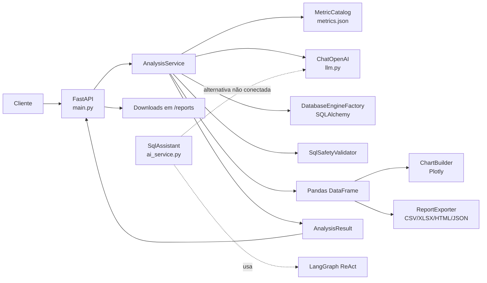
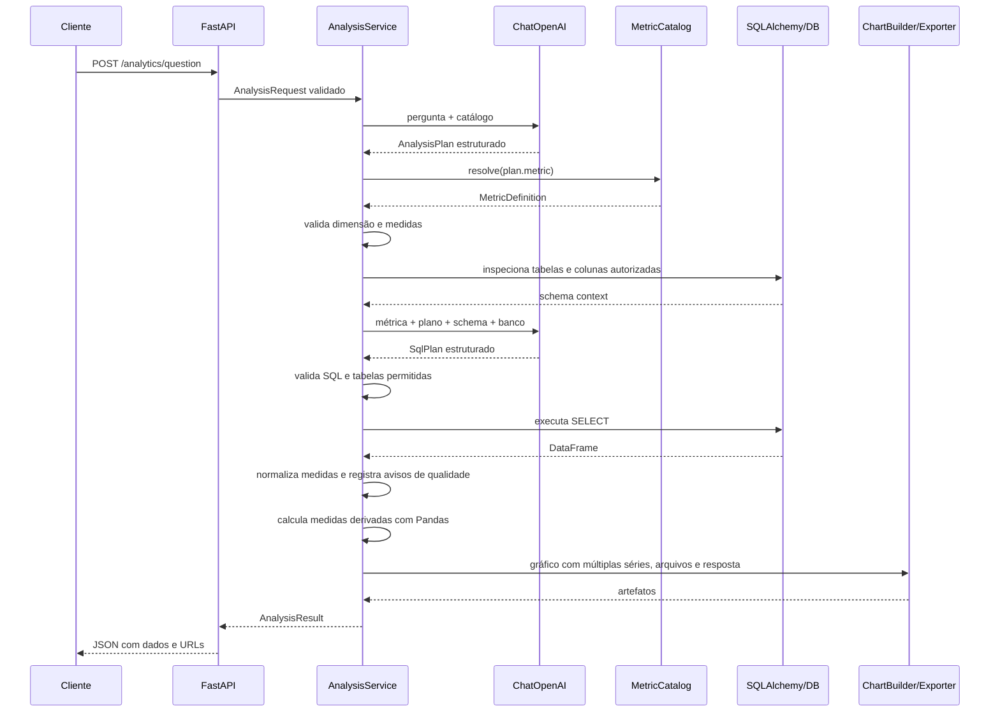

# Arquitetura do `relatorios-service`

Este documento descreve a arquitetura implementada no código atual do projeto,
incluindo o fluxo completo de uma análise e os controles que formam o harness da
aplicação.

## 1. Escopo e significado de “harness”

O serviço é uma API que recebe perguntas em linguagem natural sobre dados de
RH, transforma a pergunta em uma consulta SQL de leitura, executa a consulta e
retorna uma resposta textual, os dados, um gráfico e arquivos para download.

O repositório não possui uma classe ou um módulo chamado `Harness`. Neste
documento, **harness** significa a camada de orquestração e de proteção que
coordena o modelo de linguagem, o catálogo de métricas, o banco, o Pandas, o
Plotly e a exportação de relatórios. Essa camada está concentrada em:

- `src/relatorios_service/main.py`: entrada HTTP e tradução de erros para
  respostas da API;
- `src/relatorios_service/analysis_service.py`: orquestração do caso de uso de
  análise;
- `src/relatorios_service/metric_catalog.py` e o catálogo local
  `src/relatorios_service/resources/metrics.json`: vocabulário e regras de
  negócio autorizados;
- `src/relatorios_service/sql_safety.py`: validação da SQL produzida pelo
  modelo;
- `src/relatorios_service/schemas.py`: contratos estruturados usados pela API e
  pelas saídas do modelo.

O fluxo usado pela API é um pipeline controlado por etapas. Embora o projeto
tenha dependência do LangGraph, o endpoint `/analytics/question` não usa um
agente ReAct nem um grafo LangGraph: ele chama o modelo em etapas explícitas.
O módulo `ai_service.py` contém uma implementação alternativa de assistente SQL
com `create_react_agent`, mas atualmente não é importado pelo fluxo da API.

## 2. Visão geral



### Responsabilidades por camada

| Camada | Componentes | Responsabilidade |
| --- | --- | --- |
| Entrada HTTP | `main.py` | Publicar endpoints, validar o corpo via Pydantic, converter exceções e entregar arquivos. |
| Aplicação/orquestração | `AnalysisService` | Executar o pipeline de planejamento, validação, consulta, resposta, gráfico e exportação. |
| Contratos | `schemas.py` | Definir enums e modelos para requisição, plano, SQL e resultado. |
| Conhecimento de negócio | `MetricCatalog`, `metrics.json` | Restringir as métricas, tabelas, colunas, dimensões e regras conhecidas. |
| Inteligência artificial | `llm.py` e `ChatOpenAI` | Gerar o plano, a SQL e a resposta textual, sempre dentro dos contratos esperados. |
| Persistência de dados | `database.py` | Criar o engine SQLAlchemy para PostgreSQL, SQL Server ou Oracle e testar a conexão. |
| Segurança de SQL | `sql_safety.py` | Aceitar somente uma consulta de leitura e impedir referências a tabelas ou colunas fora do escopo da métrica. |
| Transformação e visualização | `pandas`, `ChartBuilder` | Ler resultados, limitar o volume retornado e construir o gráfico Plotly. |
| Saída | `ReportExporter` | Gravar CSV, XLSX, `chart.json` e `chart.html` no diretório de relatórios. |

## 3. Estrutura do projeto

```text
relatorios-service/
├── Arquitetura.md
├── README.md
├── .env.example
├── pyproject.toml
├── requirements.txt
├── uv.lock
├── docs/
│   └── metric_catalog.md
└── src/relatorios_service/
    ├── __init__.py
    ├── main.py
    ├── analysis_service.py
    ├── ai_service.py
    ├── chart_service.py
    ├── config.py
    ├── database.py
    ├── file_reader.py
    ├── llm.py
    ├── metric_catalog.py
    ├── report_exporter.py
    ├── schemas.py
    ├── sql_safety.py
    └── resources/
        ├── metrics.example.json
        └── metrics.json (criado localmente e ignorado pelo Git)
```

O pacote usa o layout `src`. Por isso, a instalação editável (`pip install -e
.`) ou o uso de `uv run` é necessário para que o pacote seja encontrado. Os
comandos de instalação e inicialização estão em [README.md](README.md).

## 4. Inicialização da aplicação

O processo normalmente é iniciado com:

```text
uv run uvicorn relatorios_service.main:app --reload
```

Durante a importação de `main.py`:

1. O `FastAPI` cria a aplicação.
2. `config.py` instancia `Settings`, carregando `.env` e variáveis de
   ambiente com codificação UTF-8.
3. O módulo cria instâncias globais de `FileReader`,
   `DatabaseEngineFactory` e `AnalysisService`.
4. A inicialização de `AnalysisService` carrega o catálogo de métricas,
   prepara os builders/validadores e cria o objeto `ChatOpenAI`.
5. Nenhuma consulta ao banco é feita nessa fase. O engine é criado somente
   quando um endpoint precisa acessar o banco.

As variáveis `OPENAI_API_KEY` e `LLM_MODEL` são obrigatórias porque o modelo é
criado na inicialização. O banco é selecionado por `DATABASE_TYPE` e acessado
por `DATABASE_URL`. A configuração completa está em `.env.example`.

Configurações relevantes:

| Variável | Padrão/obrigatoriedade | Uso |
| --- | --- | --- |
| `OPENAI_API_KEY` | obrigatória | Chave para o provedor compatível com a API da OpenAI. |
| `LLM_MODEL` | obrigatória | Modelo utilizado nas três chamadas do fluxo de análise. |
| `OPENAI_BASE_URL` | opcional | Endpoint alternativo compatível com a API da OpenAI. |
| `DATABASE_TYPE` | `postgres` | Valores aceitos: `postgres`, `sqlserver`, `oracle`. |
| `DATABASE_URL` | obrigatória para acesso ao banco | URL SQLAlchemy do banco ativo. |
| `REPORTS_DIRECTORY` | `reports` | Diretório base dos relatórios gerados. |
| `MAX_ANALYSIS_ROWS` | `10000` | Limite aplicado ao DataFrame depois da consulta. |

## 5. Harness ativo: fluxo completo de análise

O fluxo abaixo é executado por `AnalysisService.analyze` após o recebimento de
`POST /analytics/question`.



### 5.1 Validação da requisição

`AnalysisRequest` é validado pelo Pydantic antes de entrar no serviço:

- `question` é obrigatório e deve ter pelo menos cinco caracteres;
- `chart_type` é opcional e aceita `auto`, `bar`, `line`, `pie`, `scatter` ou
  `table`; quando omitido, os tipos definidos pelo plano do gráfico são
  preservados;
- `export_formats` aceita `csv` e `xlsx` e começa vazio quando não é enviado.

Um corpo inválido é rejeitado pelo FastAPI antes da execução do harness.

### 5.2 Geração do plano de análise

`_create_analysis_plan` envia ao modelo:

- o schema JSON de `AnalysisPlan`;
- o catálogo completo de métricas;
- a pergunta do usuário;
- regras para não inventar métricas, tabelas ou colunas, extrair período e
  filtros e ignorar instruções da pergunta que tentem alterar o prompt.

O modelo deve retornar um objeto com um ou mais `components`. Cada componente
usa somente `generic_analysis` e possui suas próprias tabelas, medidas,
dimensões, filtros e período. A composição pode ser `aligned`, quando os
componentes compartilham chaves, ou `series`, quando representam séries
independentes.

```json
{
  "components": [
    {
      "id": "allocation",
      "metric": "generic_analysis",
      "measures": ["allocation_hours"],
      "dimensions": ["month", "workplace"],
      "filters": {}
    }
  ],
  "composition": {
    "mode": "aligned",
    "keys": ["month", "workplace"]
  },
  "chart": {
    "x": "month",
    "series": [
      {"column": "allocation_hours", "chart_type": "bar"},
      {"column": "demand_hours", "chart_type": "line"}
    ]
  },
  "requested_exports": ["xlsx"],
  "reasoning": "..."
}
```

O retorno é novamente validado como `AnalysisPlan`. O texto em
`reasoning` é preservado no resultado, mas não é usado como autorização para
executar a consulta.

Quando duas séries usam a mesma medida e precisam de tipos de gráfico
distintos, cada série deve referenciar seu componente com `component_id`:

```json
{
  "composition": {"mode": "series"},
  "chart": {
    "x": "month",
    "series": [
      {
        "column": "demand_hours",
        "component_id": "grupo_exemplo_a",
        "chart_type": "bar",
        "label": "Grupo Exemplo A"
      },
      {
        "column": "demand_hours",
        "component_id": "grupo_exemplo_b",
        "chart_type": "line",
        "label": "Grupo Exemplo B"
      }
    ]
  }
}
```

### 5.3 Resolução da métrica e validação do plano

Para análises compostas, `AnalysisService` aceita exclusivamente a métrica
`generic_analysis`. O catálogo autoriza as tabelas e colunas selecionadas para
cada componente e também define `allocation_hours` e `demand_hours` quando
essas medidas são solicitadas.

Em seguida, `_validate_plan` aplica regras determinísticas:

1. Cada dimensão precisa estar em `allowed_dimensions`.
2. Cada medida precisa estar em `allowed_measures`.
3. Cada componente precisa usar `generic_analysis`.
4. Componentes alinhados precisam retornar uma linha única por chave de
   composição.

Os filtros do componente carregam valores identificados na pergunta e não são
uma lista de valores autorizados. A tabela e a coluna usadas para cada conceito
são orientadas por `semantic_mappings` e validadas novamente na SQL final.

Os campos legados `metric`, `tables`, `measures`, `group_by`, `filters` e
`chart_type` ainda são aceitos para compatibilidade. O serviço os converte para
um componente único.

Cada componente é executado e validado separadamente. Isso permite combinar
resultados sem ampliar o escopo de tabelas autorizado de uma consulta.

Quando `demand_hours` usa o parser semanal, o SQL retorna `demand_schedule` e
`analysis_date`; a camada de normalização produz `demand_hours` antes da
composição.

As medidas derivadas `deficit_hours` e `coverage_percent` são calculadas após a
composição alinhada quando `allocation_hours` e `demand_hours` estão presentes.

A `business_rule` é enviada ao modelo como contexto para a SQL. Ela não é
recalculada por um parser determinístico depois que o modelo produz a consulta;
por isso, a qualidade do catálogo e os testes das métricas são parte essencial
do controle do sistema. As medidas também podem declarar um parser
determinístico, como `weekly_24h_json`, para normalizar valores brutos antes do
Pandas.

### 5.4 Descoberta do schema do banco

`DatabaseEngineFactory` converte `DATABASE_TYPE` para o enum `DatabaseType` e
cria um engine SQLAlchemy com `pool_pre_ping=True`.

Antes de gerar a SQL, `_schema_context` usa `sqlalchemy.inspect` para:

1. listar as tabelas existentes;
2. confirmar que todas as tabelas derivadas de `metric.tables` existem;
3. obter as colunas e os tipos dessas tabelas;
4. obter até cinco linhas de amostra usando somente as colunas autorizadas;
5. enviar ao modelo a estrutura e as amostras das tabelas da métrica
  selecionada.

As linhas de amostra servem apenas para indicar formatos, valores nulos e
variações dos dados. Elas são tratadas no prompt como dados não confiáveis,
e não como instruções para o modelo.

Se uma tabela autorizada não existir, o fluxo termina com erro e orienta a
atualização do catálogo.

O serviço usa um único banco por execução do processo. A troca de banco exige
alterar `DATABASE_TYPE` e `DATABASE_URL` e reiniciar a aplicação.

Quando um componente genérico usa `allocation_hours` e
`demand_hours`, o serviço calcula `deficit_hours` e
`coverage_percent` com Pandas quando as duas medidas estão presentes. Quando a
demanda é um JSON semanal, o SQL retorna `demand_schedule` e `analysis_date`,
e a camada de normalização produz `demand_hours`.

### 5.5 Geração do plano SQL

`_create_sql_plan` faz uma chamada estruturada para cada componente. O
prompt recebe:

- o dialeto do banco (`postgres`, `sqlserver` ou `oracle`);
- a definição completa da métrica;
- o `AnalysisComponent`;
- o schema descoberto no banco.

O modelo deve retornar um `SqlPlan` contendo `sql`, `parameters` e uma
`explanation`. `parameters` contém os valores dos placeholders nomeados usados
pela consulta. A consulta esperada é uma única instrução `SELECT` ou
`WITH ... SELECT`, sem ponto e vírgula interno, comentários ou operações de
escrita. Os valores identificados na pergunta não podem ser concatenados na
SQL.

### 5.6 Guardrails da SQL

Antes da execução, `SqlSafetyValidator.validate` aplica as seguintes verificações:

- a SQL não pode estar vazia;
- deve começar com `SELECT` ou `WITH`;
- não pode conter mais de uma instrução;
- não pode conter `--`, `/*` ou `*/`;
- não pode conter as palavras de operação `INSERT`, `UPDATE`, `DELETE`, `DROP`,
  `ALTER`, `TRUNCATE`, `MERGE`, `CREATE`, `GRANT`, `REVOKE`, `EXEC` ou
  `EXECUTE`;
- referências encontradas depois de `FROM` e `JOIN` precisam corresponder às
  tabelas permitidas pela métrica ou a nomes de CTE;
- referências qualificadas a colunas precisam existir nas colunas cadastradas
  em `metric.tables`;
- placeholders nomeados precisam ter um valor em `SqlPlan.parameters`, sem
  parâmetros não utilizados;
- um ponto e vírgula final é removido antes da execução.

O validador é intencionalmente simples e baseado em expressões regulares. Ele
não é um parser SQL completo. O banco também não é configurado como somente
leitura pelo código; a proteção atual é uma política da aplicação e deve ser
complementada por credenciais de banco sem permissão de escrita.

### 5.7 Execução e limite de dados

Depois da validação, o serviço executa a consulta com
`pandas.read_sql(text(sql), connection, params=parameters)`. O engine é
descartado no bloco `finally`, inclusive quando a consulta ou uma etapa
posterior falha.

O limite `MAX_ANALYSIS_ROWS` é aplicado **depois** de o banco retornar o
resultado:

1. o serviço verifica se o DataFrame excede o limite;
2. se exceder, mantém apenas `head(MAX_ANALYSIS_ROWS)`;
3. define `truncated=true`;
4. usa o DataFrame limitado para a resposta, o gráfico e as exportações.

Consequentemente, o limite atual não reduz o volume lido do banco. Além disso,
`row_count` representa a quantidade de linhas devolvida pelo DataFrame final,
não a quantidade original existente no banco.

### 5.8 Gráfico

`ChartBuilder.build` recebe o DataFrame e um `ChartSpec`:

- quando `request.chart_type` é informado, ele sobrescreve o tipo das séries;
- para `table`, DataFrame vazio ou resultado sem coluna numérica e dimensão, não
  há gráfico;
- `x`, `color` e cada série são definidos explicitamente no `ChartSpec`;
- `component_id` limita uma série aos dados do componente correspondente;
- `auto` escolhe linha quando o nome da dimensão contém `date`, `month`,
  `year`, `data`, `mes` ou `ano`; nos demais casos escolhe barras;
- barras e linhas podem existir no mesmo gráfico;
- uma série pode usar o eixo secundário quando possuir unidade diferente.

O resultado é serializado como JSON Plotly. O gráfico pode ser `null` mesmo
quando a análise foi concluída com sucesso.

### 5.9 Exportação

Os formatos pedidos no corpo da requisição são combinados com os formatos que o
modelo identificou em `plan.requested_exports`, sem duplicação.

Quando aplicável, os artefatos ficam organizados por análise:

```text
<REPORTS_DIRECTORY>/<report_id>/analysis.csv
<REPORTS_DIRECTORY>/<report_id>/analysis.xlsx
<REPORTS_DIRECTORY>/<report_id>/chart.json
<REPORTS_DIRECTORY>/<report_id>/chart.html
```

`analysis.csv` é gravado em UTF-8 com BOM (`utf-8-sig`) para facilitar a
abertura em planilhas. `chart.html` é autocontido e inclui o JavaScript do
Plotly. Os arquivos do gráfico só são criados quando há um gráfico.

### 5.10 Geração da resposta textual

`_create_answer` faz a terceira chamada ao modelo. O prompt contém somente:

- a pergunta original;
- o plano de análise;
- no máximo os primeiros 100 registros do DataFrame final;
- uma observação caso o resultado tenha sido truncado.

O modelo deve responder em português do Brasil, usando apenas os valores
calculados e sem mostrar SQL. Se houve truncamento, o serviço acrescenta uma
observação fixa à resposta.

### 5.11 Contrato do resultado

`AnalysisResult` retorna:

| Campo | Conteúdo |
| --- | --- |
| `report_id` | Identificador hexadecimal da análise. |
| `answer` | Resposta textual gerada pelo modelo. |
| `plan` | Plano estruturado usado na análise. |
| `sql` | SQL validada e executada. |
| `sqls` | Todas as SQLs executadas, uma por componente. |
| `row_count` | Linhas presentes no DataFrame final. |
| `truncated` | Indica se o limite de linhas foi aplicado. |
| `data` | Registros serializados em JSON, com datas em ISO. |
| `chart` | Estrutura Plotly ou `null`. |
| `files` | Formato, nome e URL dos arquivos gerados. |

## 6. Endpoints

| Método e rota | Fluxo | Respostas relevantes |
| --- | --- | --- |
| `GET /health` | Verifica somente se a API está viva. | `{"status": "ok"}`. |
| `GET /database/health` | Cria uma conexão e executa `SELECT 1`; Oracle usa `SELECT 1 FROM dual`. | Banco ativo e `connected`, ou `500`. |
| `POST /analytics/question` | Executa todo o harness de análise. | JSON de `AnalysisResult`; `400` para `ValueError`; `500` para erros não tratados como validação. |
| `POST /files/preview` | Lê CSV, XLSX, XLS ou JSON e retorna as primeiras 20 linhas. | Nome, total, colunas e preview; `400` para formato/conteúdo inválido. |
| `GET /reports/{report_id}/csv` | Entrega `analysis.csv`. | Arquivo ou `404`. |
| `GET /reports/{report_id}/xlsx` | Entrega `analysis.xlsx`. | Arquivo ou `404`. |
| `GET /reports/{report_id}/chart.json` | Entrega o JSON Plotly. | Arquivo ou `404`. |
| `GET /reports/{report_id}/chart.html` | Entrega o gráfico HTML. | Arquivo ou `404`. |

O endpoint de preview lê o upload inteiro em memória e não persiste o arquivo
original. O endpoint de análise não recebe arquivos: ele consulta o banco
configurado.

## 7. Configuração de banco e drivers

Os dialetos suportados são definidos pelo enum `DatabaseType`:

- PostgreSQL: `postgresql+psycopg://...`;
- SQL Server: `mssql+pyodbc://...` e driver ODBC instalado no sistema;
- Oracle: `oracle+oracledb://...`.

O código depende do driver Python e também dos componentes nativos quando o
driver os exige. A aplicação não executa migrações nem cria tabelas; o schema
real precisa existir no banco antes de uma métrica ser utilizada.

## 8. Catálogo de métricas como fronteira de negócio

`metrics.json` é a fonte operacional local do catálogo. O repositório publica
somente `metrics.example.json`, com nomes e valores fictícios. Cada entrada do
catálogo possui:

- `key`: identificador estável usado pelo plano;
- `label` e `description`: contexto semântico;
- `business_rule`: regra que deve orientar a consulta;
- `tables`: allowlist de tabelas. Cada tabela contém sua descrição e o mapa
  `columns`, com a descrição de cada coluna e `example_value` opcional para
  formatos especiais, como JSON armazenado em texto;
- `semantic_mappings`: tradução de termos da pergunta para tabela e coluna
  física;
- `allowed_dimensions`: dimensões aceitas para agrupamento;
- `synonyms`: termos que ajudam o modelo a reconhecer a intenção.

Ao adicionar uma métrica, o fluxo recomendado é:

1. copiar `metrics.example.json` para `metrics.json` no ambiente local;
2. confirmar o schema e a regra com o responsável pelo banco/negócio;
3. atualizar somente o arquivo local `src/relatorios_service/resources/metrics.json`;
4. documentar a métrica sem incluir nomes do banco em arquivos públicos;
5. criar casos de teste para pergunta, SQL gerada, regra de negócio e
   resultado esperado;
6. validar a métrica contra cada banco suportado quando houver diferenças de
  dialeto.

O catálogo é pequeno e enviado diretamente ao modelo. A introspecção do banco
confirma tipos, chaves e existência somente das tabelas e colunas cadastradas;
colunas não presentes em `tables.<tabela>.columns` não são enviadas ao modelo
nem podem ser usadas na SQL final. Não existe RAG no fluxo atual.

## 9. Fluxo alternativo em `ai_service.py`

`SqlAssistant` implementa uma segunda estratégia:

1. cria um `SQLDatabase` limitado a `allowed_tables`;
2. cria um `SQLDatabaseToolkit`;
3. carrega o prompt `langchain-ai/sql-agent-system-prompt` pelo LangChain Hub;
4. cria um agente ReAct com `create_react_agent` do LangGraph;
5. responde a uma pergunta chamando `agent.invoke`.

Essa estratégia não é usada por `main.py` nem por `AnalysisService`. Ela deve
ser considerada um protótipo/rota alternativa, não parte do contrato atual da
API. Se for ativada, os mesmos guardrails do fluxo principal precisam ser
reaplicados, especialmente validação de SQL, controle de colunas, auditoria e
credenciais somente leitura.

## 10. Segurança e limitações atuais

Os controles do fluxo principal incluem tabelas e colunas autorizadas,
comandos somente leitura e parâmetros nomeados para valores da pergunta.
Ainda existem decisões técnicas importantes antes de tratar o serviço como
uma plataforma multiusuário ou de produção:

- uma tabela só pode ser usada quando possui colunas cadastradas em
  `tables.<tabela>.columns`; isso evita que a introspecção libere colunas não
  revisadas;
- o limite de linhas é aplicado após a leitura completa do banco, sem `LIMIT`,
  `TOP`, `FETCH` ou equivalente no SQL;
- a expressão regular de SQL não substitui um parser por dialeto;
- a conexão depende das permissões do usuário configurado; o código não força
  uma role de banco somente leitura;
- não há autenticação, autorização, isolamento por usuário/tenant, rate limit,
  fila de execução ou timeout de consulta implementados;
- não há logging estruturado, auditoria das perguntas/SQL ou política de
  retenção/limpeza do diretório de relatórios;
- os erros internos podem ser incluídos no campo `detail` das respostas HTTP;
- o `report_id` gerado pelo fluxo normal é um UUID hexadecimal, mas as rotas de
  download aceitam texto livre e montam o caminho diretamente. A validação do
  identificador e a proteção contra traversal devem ser adicionadas antes de
  expor esses endpoints em ambiente não confiável;
- o modelo recebe dados do resultado para escrever a resposta. Dados sensíveis
  precisam de uma política de minimização, mascaramento ou autorização antes
  de serem enviados ao provedor de LLM.
- `database_health` cria um engine para o teste de conexão, mas o caminho atual
  não chama `dispose` explicitamente nesse endpoint; isso deve ser revisado se
  o health check for chamado em alta frequência.

Não há uma suíte de testes automatizados versionada no diretório atual. O
comportamento descrito aqui foi obtido da implementação e deve ser coberto por
testes antes de alterações no catálogo, no validador SQL ou no pipeline de
produção.

## 11. Decisões estratégicas em aberto

As decisões abaixo devem ser respondidas antes de ampliar o harness:

1. O fluxo principal continuará sendo planner + SQL estruturada + validadores
   determinísticos, ou `SqlAssistant` deverá substituir/compartilhar esse
   caminho?
2. A segurança deve exigir role de banco somente leitura e validação por AST,
   incluindo colunas, funções, schemas, joins e limites de custo?
3. O serviço terá usuários/tenants distintos? Em caso afirmativo, como serão
   aplicados autenticação, autorização, isolamento dos relatórios e retenção
   dos arquivos?
4. As regras de negócio do catálogo serão apenas instruções para o modelo ou
   também terão verificações determinísticas por métrica?
5. O resultado precisa trazer a quantidade total encontrada no banco, além da
   quantidade efetivamente retornada após `MAX_ANALYSIS_ROWS`?

Essas respostas influenciam diretamente a próxima versão dos contratos, do
validador SQL, da persistência dos relatórios e do modelo de execução.
